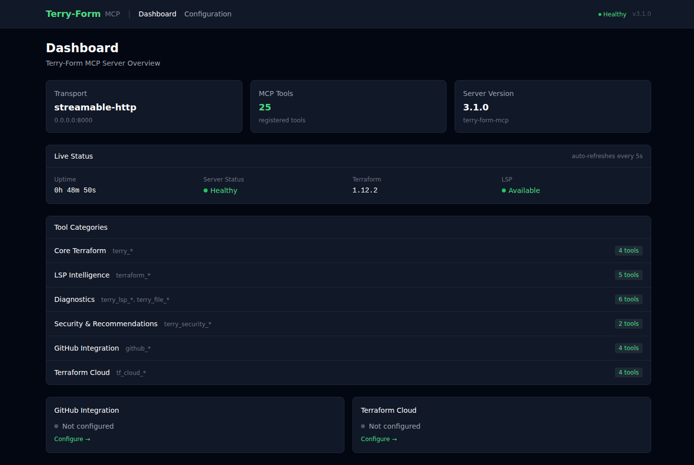
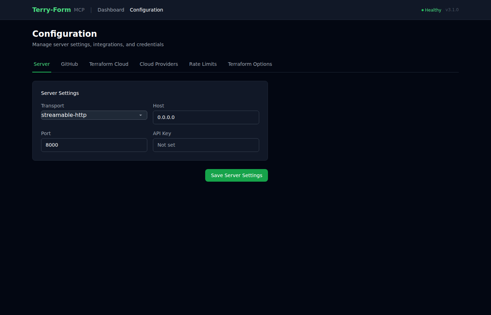
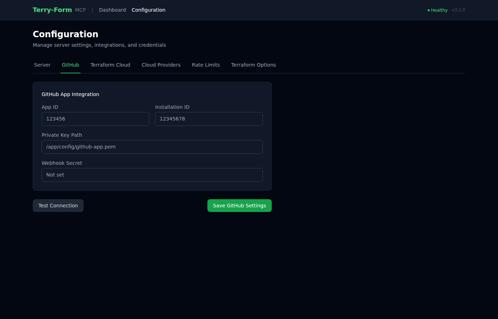
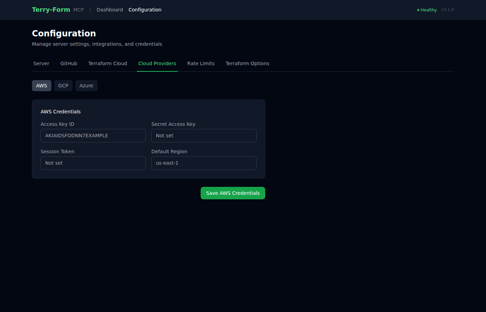
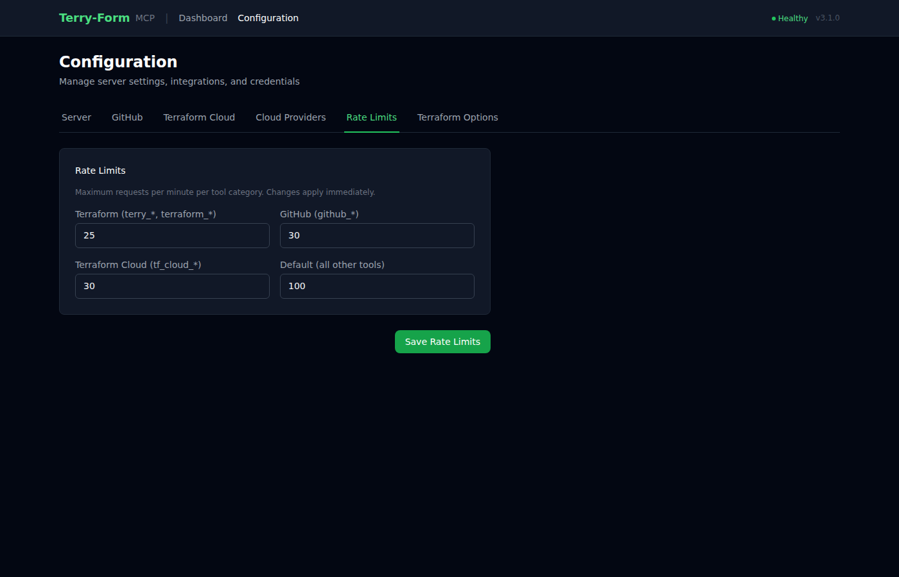
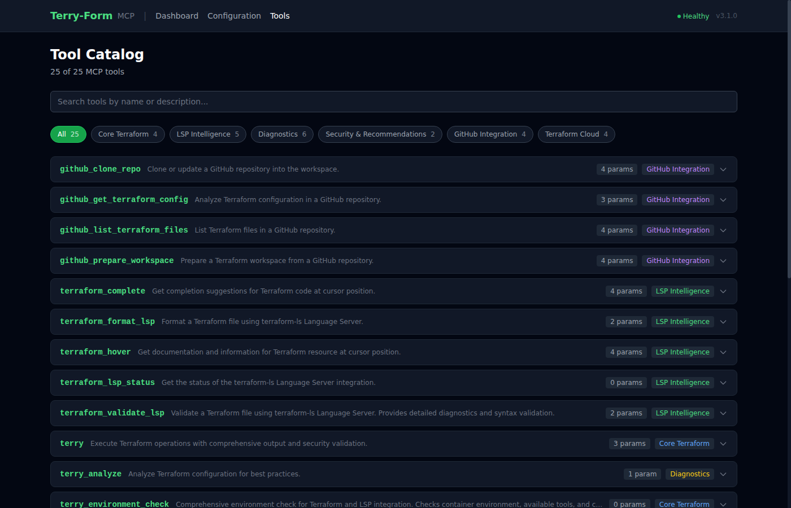

# Terry-Form MCP

**AI-powered Terraform execution through the Model Context Protocol.**

[](https://github.com/aj-geddes/terry-form-mcp/releases)
[](https://opensource.org/licenses/MIT)
[](https://github.com/aj-geddes/terry-form-mcp/blob/main/Dockerfile)
[](https://www.python.org/)

Terry-Form MCP is a containerized [Model Context Protocol](https://modelcontextprotocol.io/) server that gives AI assistants like Claude safe, structured access to Terraform. It exposes 25 MCP tools spanning Terraform execution, LSP intelligence, GitHub integration, and Terraform Cloud connectivity — all running inside Docker with destructive operations blocked by design.

**[Documentation Site](https://aj-geddes.github.io/terry-form-mcp)**

---

## Dashboard



The built-in web dashboard provides real-time server health monitoring, tool category overview, and integration status at a glance. Live status auto-refreshes every 5 seconds.

## Configuration UI



A tabbed configuration interface lets you manage server settings, integrations, cloud provider credentials, and rate limits — all without touching config files. Built with the HAT stack (HTMX + Alpine.js + Tailwind CSS).

| GitHub Integration | Cloud Providers | Rate Limits |
|---|---|---|
|  |  |  |

## Tool Catalog



The interactive tool catalog at `/tools` lists all 25 MCP tools with search, category filtering, and expandable parameter details. Also available as a raw JSON endpoint at `/api/tools` and as a static [`tools.json`](tools.json) file.

---

## Quick Start

### Prerequisites

- Docker installed and running
- Python >= 3.10 (for local development)

### 1. Build

```bash
scripts/build.sh      # Linux/macOS
scripts\build.bat     # Windows
# or directly:
docker build -t terry-form-mcp .
```

### 2. Run as MCP Server

```bash
docker run -it --rm \
  -v "$(pwd)":/mnt/workspace \
  terry-form-mcp
```

### 3. Verify the Image

```bash
scripts/verify.sh   # Runs 8 checks: Docker, image size, Terraform, terraform-ls, Python, files, tools, startup
```

---

## Environment Variables

All configuration is through environment variables. No config file is required for basic use.

### Server Configuration

| Variable | Description | Default | Required |
|----------|-------------|---------|----------|
| `MCP_TRANSPORT` | Transport protocol: `stdio`, `sse`, or `streamable-http` | `stdio` | No |
| `TERRY_HOST` | Server bind address (fallback: `HOST`) | `0.0.0.0` | No |
| `TERRY_PORT` | Server port (fallback: `PORT`) | `8000` | No |
| `TERRY_FORM_API_KEY` | API key for frontend auth; if unset, auth is disabled | None | No |
| `TERRY_CSRF_SECRET` | CSRF token secret; regenerated on restart if unset | Random | Recommended |
| `TERRY_WORKSPACE_ROOT` | Terraform workspace root directory | `/mnt/workspace` | No |
| `TERRY_CONFIG_PATH` | Config file path | `/app/config/terry-config.json` | No |

### Terraform

| Variable | Description | Default | Required |
|----------|-------------|---------|----------|
| `MAX_OPERATION_TIMEOUT` | Terraform command timeout in seconds (10–3600) | `300` | No |

### LSP

| Variable | Description | Default | Required |
|----------|-------------|---------|----------|
| `TERRY_TERRAFORM_LS_PATH` | Path to `terraform-ls` binary | `terraform-ls` | No |
| `TERRY_LSP_TIMEOUT` | LSP request timeout in seconds | `30` | No |
| `TERRY_LSP_MAX_RESPONSE_BYTES` | Maximum LSP response size in bytes | `10485760` | No |

### GitHub Integration

| Variable | Description | Default | Required |
|----------|-------------|---------|----------|
| `GITHUB_APP_ID` | GitHub App ID | None | For GitHub features |
| `GITHUB_APP_PRIVATE_KEY_PATH` | Path to GitHub App private key file | None | For GitHub features |
| `GITHUB_APP_PRIVATE_KEY` | GitHub App private key (inline PEM) | None | Alt to path |
| `GITHUB_APP_INSTALLATION_ID` | GitHub App installation ID | None | No |
| `GITHUB_APP_WEBHOOK_SECRET` | Webhook signature verification secret | None | No |

### Terraform Cloud

| Variable | Description | Default | Required |
|----------|-------------|---------|----------|
| `TF_API_TOKEN` | Terraform Cloud API token | None | For TF Cloud features |

### Rate Limits

| Variable | Description | Default | Required |
|----------|-------------|---------|----------|
| `TERRY_RATE_LIMIT_TERRAFORM` | Terraform operations per minute | `20` | No |
| `TERRY_RATE_LIMIT_GITHUB` | GitHub operations per minute | `30` | No |
| `TERRY_RATE_LIMIT_TF_CLOUD` | Terraform Cloud operations per minute | `30` | No |
| `TERRY_RATE_LIMIT_DEFAULT` | Default rate limit per minute | `100` | No |

### Cloud Provider Passthrough

These variables are forwarded directly to the Terraform subprocess. Set them to authenticate with your cloud provider.

**AWS:** `AWS_ACCESS_KEY_ID`, `AWS_SECRET_ACCESS_KEY`, `AWS_SESSION_TOKEN`, `AWS_DEFAULT_REGION`, `AWS_REGION`, `AWS_PROFILE`

**GCP:** `GOOGLE_CREDENTIALS`, `GOOGLE_APPLICATION_CREDENTIALS`, `GOOGLE_PROJECT`, `GOOGLE_REGION`, `GOOGLE_ZONE`

**Azure:** `ARM_CLIENT_ID`, `ARM_CLIENT_SECRET`, `ARM_SUBSCRIPTION_ID`, `ARM_TENANT_ID`

---

## MCP Client Configuration

Add Terry-Form to any MCP-compatible client:

```json
{
  "mcpServers": {
    "terry": {
      "command": "docker",
      "args": [
        "run", "-i", "--rm",
        "-v", "/path/to/your/workspace:/mnt/workspace",
        "terry-form-mcp"
      ]
    }
  }
}
```

<details>
<summary>Platform-specific examples</summary>

**Claude Desktop (Windows)**
```json
{
  "mcpServers": {
    "terry": {
      "command": "docker",
      "args": [
        "run", "-i", "--rm",
        "-v", "C:\\Users\\YourUsername\\terraform-projects:/mnt/workspace",
        "terry-form-mcp"
      ]
    }
  }
}
```

**Claude Desktop (macOS)**
```json
{
  "mcpServers": {
    "terry": {
      "command": "docker",
      "args": [
        "run", "-i", "--rm",
        "-v", "/Users/YourUsername/terraform-projects:/mnt/workspace",
        "terry-form-mcp"
      ]
    }
  }
}
```

**VSCode (uses workspace variable)**
```json
{
  "mcp.servers": {
    "terry": {
      "command": "docker",
      "args": [
        "run", "-i", "--rm",
        "-v", "${workspaceFolder}:/mnt/workspace",
        "terry-form-mcp"
      ]
    }
  }
}
```

</details>

---

## Tools (25)

| Category | Tools | Count |
|---|---|---|
| **Core Terraform** | `terry`, `terry_version`, `terry_environment_check`, `terry_workspace_list` | 4 |
| **LSP Intelligence** | `terraform_validate_lsp`, `terraform_hover`, `terraform_complete`, `terraform_format_lsp`, `terraform_lsp_status` | 5 |
| **Diagnostics** | `terry_lsp_debug`, `terry_workspace_info`, `terry_lsp_init`, `terry_file_check`, `terry_workspace_setup`, `terry_analyze` | 6 |
| **Security** | `terry_security_scan`, `terry_recommendations` | 2 |
| **GitHub** | `github_clone_repo`, `github_list_terraform_files`, `github_get_terraform_config`, `github_prepare_workspace` | 4 |
| **Terraform Cloud** | `tf_cloud_list_workspaces`, `tf_cloud_get_workspace`, `tf_cloud_list_runs`, `tf_cloud_get_state_outputs` | 4 |

### Core Terraform

```python
# Initialize and validate a project
terry(path="infrastructure/aws", actions=["init", "validate"])

# Plan with variables
terry(path="environments/prod", actions=["plan"], vars={"instance_count": "3", "region": "us-east-1"})
```

Only `init`, `validate`, `fmt`, and `plan` are permitted. `apply` and `destroy` are blocked.

### LSP Intelligence

```python
# Code completions
terraform_complete(file_path="main.tf", line=10, character=0)

# Hover documentation
terraform_hover(file_path="main.tf", line=15, character=12)

# Detailed validation with error locations
terraform_validate_lsp(file_path="main.tf")

# Format a file
terraform_format_lsp(file_path="main.tf")
```

Powered by `terraform-ls` v0.38.5 — provides context-aware completions, inline documentation, and diagnostics with precise source locations.

### GitHub Integration

```python
# Clone a repo and prepare it for Terraform operations
github_clone_repo(owner="myorg", repo="infrastructure")
github_prepare_workspace(owner="myorg", repo="infrastructure", config_path="environments/prod")
```

### Security Scanning

```python
# Scan for hardcoded credentials, missing encryption, overly permissive policies
terry_security_scan(path="my-project")

# Get actionable improvement recommendations
terry_recommendations(path="my-project")
```

---

## Architecture

```
┌─────────────┐     MCP Protocol     ┌──────────────────────────────────────┐
│ AI Assistant │ ◄──────────────────► │  Terry-Form MCP Server               │
│ (Claude)     │                      │                                      │
└─────────────┘                      │  ┌─────────────┐  ┌──────────────┐  │
                                     │  │ Terraform    │  │ terraform-ls │  │
                                     │  │ CLI 1.12     │  │ LSP 0.38.5   │  │
                                     │  └──────┬───────┘  └──────┬───────┘  │
                                     │         │                 │          │
                                     │         ▼                 ▼          │
                                     │  ┌──────────────────────────────┐   │
                                     │  │   /mnt/workspace (isolated)   │   │
                                     │  └──────────────────────────────┘   │
                                     └──────────────────────────────────────┘
                                              Docker Container
```

### Key Components

| File | Purpose |
|---|---|
| `src/server_enhanced_with_lsp.py` | Main FastMCP server — registers all 25 tools |
| `src/terry-form-mcp.py` | Core Terraform subprocess execution |
| `src/terraform_lsp_client.py` | Async LSP client wrapping `terraform-ls` |
| `src/mcp_request_validator.py` | Input sanitization, path traversal prevention, rate limiting |
| `src/github_repo_handler.py` | Clone repos and extract Terraform files |
| `src/github_app_auth.py` | GitHub App JWT/OAuth authentication |
| `src/frontend/` | HAT stack web UI (dashboard + configuration) |

### Frontend Stack

The built-in web UI uses the **HAT stack**:
- **H**TMX 2.0 — partial page updates without full reloads
- **A**lpine.js 3.14 — lightweight client-side reactivity for tabs and toasts
- **T**ailwind CSS — dark-mode-first utility styling

Accessible at the server root when running with `streamable-http` or `sse` transport.

---

## Security Model

Terry-Form implements defense-in-depth with four layers:

| Layer | Protection |
|---|---|
| **Container Isolation** | All execution in ephemeral Docker containers. No host access. |
| **Operation Allowlist** | Only `init`, `validate`, `fmt`, `plan`. No `apply`/`destroy`. |
| **Workspace Isolation** | All file operations restricted to `/mnt/workspace`. Path traversal blocked. |
| **Input Validation** | JSON schema enforcement, variable sanitization, rate limiting per category. |

Forced environment variables: `TF_IN_AUTOMATION=true`, `TF_INPUT=false`, `CHECKPOINT_DISABLE=true`.

---

## Running with the Web UI

To use the dashboard and configuration UI, run with HTTP transport:

```bash
# Local
MCP_TRANSPORT=streamable-http HOST=0.0.0.0 PORT=8000 python3 src/server_enhanced_with_lsp.py

# Docker
docker run -it --rm \
  -p 8000:8000 \
  -v "$(pwd)":/mnt/workspace \
  -e MCP_TRANSPORT=streamable-http \
  terry-form-mcp
```

Then open `http://localhost:8000` in your browser.

### Configuration Tabs

| Tab | What it configures |
|---|---|
| **Server** | Transport mode, host, port, API key |
| **GitHub** | App ID, installation ID, private key path, webhook secret |
| **Terraform Cloud** | API token |
| **Cloud Providers** | AWS, GCP, and Azure credentials |
| **Rate Limits** | Per-category request limits (applied immediately) |
| **Terraform Options** | Log level, operation timeout |

---

## Container Details

Built on `hashicorp/terraform:1.12` (Alpine-based, ~150MB). Includes:
- Terraform CLI 1.12
- `terraform-ls` v0.38.5 for LSP support
- Python 3.12 with FastMCP 3.0+
- Runs as non-root user `terraform` (UID 1001)

---

## Development

```bash
# Install dependencies
pip install -r requirements.txt

# Run locally
python3 src/server_enhanced_with_lsp.py

# Code quality
black .       # Format (88-char line limit)
flake8 .      # Lint
mypy src/*.py # Type check
```

---

## Limitations

- **No state modification** — `apply` and `destroy` are intentionally blocked
- **String variables only** — complex variable types not supported via CLI passthrough
- **LSP cold start** — first LSP operation takes 1-2 seconds for initialization
- **Local execution** — designed for development workflows, not production CI/CD

---

## License

[MIT](LICENSE)
