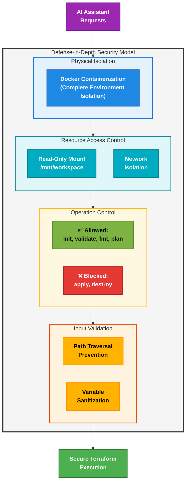

# Terry-Form MCP with LSP Integration

A Model Control Protocol (MCP) server that enables AI assistants to execute Terraform commands locally through a secure, containerized environment using HashiCorp's official Terraform image. Now enhanced with Language Server Protocol (LSP) integration for intelligent Terraform development capabilities.

## What is Terry-Form?

Terry-Form MCP is a bridge between AI language models and Terraform infrastructure management. It provides a safe, controlled way for AI assistants like Claude to:

- Execute Terraform commands (`init`, `validate`, `fmt`, `plan`)
- Provide intelligent code completion, documentation, and validation using LSP
- Run operations in isolated Docker containers
- Work with Terraform configurations in your local workspace
- Pass variables dynamically to Terraform operations
- Return structured JSON results for AI processing

## Architecture

### Component Architecture


### Data Flow and Security Architecture


### Components

- **server_enhanced_with_lsp.py**: FastMCP-based server that exposes both `terry` and LSP tools
- **terry-form-mcp.py**: Core Terraform execution logic and subprocess handling
- **terraform_lsp_client.py**: LSP client implementation for terraform-ls integration
- **Dockerfile_enhanced_lsp**: HashiCorp Terraform image with Python, FastMCP, and terraform-ls integration
- **Docker Container**: Isolated execution environment with Terraform and terraform-ls pre-installed

## Features

### Core Terraform Execution (Original Features)
- `init` - Initialize Terraform working directory
- `validate` - Validate Terraform configuration syntax
- `fmt` - Check Terraform code formatting
- `plan` - Generate and show execution plan (with variable support)

### Intelligent LSP Features (New)
- **Code Completion**: Context-aware suggestions for Terraform resources, attributes, and values
- **Hover Documentation**: Instant documentation for Terraform elements at cursor position
- **Advanced Validation**: Detailed diagnostics with precise error locations and explanations
- **LSP-based Formatting**: Professional code formatting with specific edit suggestions
- **Workspace Awareness**: Intelligent context based on your project structure

### Diagnostic Tools (New)
- **Environment Diagnostics**: Comprehensive checks for Terraform and LSP setup
- **LSP Debugging**: Detailed status information about the Language Server
- **Workspace Analysis**: Terraform project structure and readiness assessment
- **LSP Initialization**: Manual control over LSP client setup
- **File Validation**: Terraform file syntax and structure checking
- **Workspace Setup**: Automated creation of properly structured Terraform projects

### Security Features
- **Containerized Execution**: All Terraform commands run in isolated Docker containers
- **Workspace Isolation**: Operations restricted to `/mnt/workspace` mount point
- **No State Modification**: Only read-only operations (plan, validate, fmt)
- **Variable Injection**: Safe parameter passing for dynamic configurations

### AI Integration
- **Structured Output**: JSON-formatted results for AI processing
- **Error Handling**: Detailed error messages and return codes
- **Batch Operations**: Execute multiple Terraform actions in sequence
- **FastMCP Integration**: Standard MCP protocol for AI assistant compatibility

## Quick Start

### Prerequisites

- Docker installed and running
- Python 3.8+ (for development/testing)
- Access to Terraform configurations in your workspace

### 1. Build the Docker Image

```bash
# For basic Terraform execution only
docker build -t terry-form-mcp -f Dockerfile .

# For enhanced LSP features
docker build -t terry-form-mcp-lsp-enhanced -f Dockerfile_enhanced_lsp .
```

### 2. Run as MCP Server

```bash
# Basic execution features
docker run -it --rm \
  -v "$(pwd)":/mnt/workspace \
  terry-form-mcp

# Enhanced LSP features
docker run -it --rm \
  -v "$(pwd)":/mnt/workspace \
  terry-form-mcp-lsp-enhanced
```

### 3. Test with Sample Data

```bash
# Create a test workspace
docker run -i --rm \
  -v "$(pwd)":/mnt/workspace \
  terry-form-mcp-lsp-enhanced \
  python3 -c "import json; print(json.dumps({'tool': 'terry_workspace_setup', 'arguments': {'path': 'test-project', 'project_name': 'test'}}))" | \
  docker run -i --rm \
  -v "$(pwd)":/mnt/workspace \
  terry-form-mcp-lsp-enhanced

# Initialize the project
echo '{
  "tool": "terry",
  "arguments": {
    "actions": ["init"],
    "path": "test-project"
  }
}' | docker run -i --rm \
  -v "$(pwd)":/mnt/workspace \
  terry-form-mcp-lsp-enhanced
```

## Configuration

### MCP Server Configuration in IDE

Most IDEs that support MCP will have a configuration file or UI. Here's a generic configuration that works across platforms:

```json
{
  "mcpServers": {
    "terry": {
      "command": "docker",
      "args": [
        "run", "-i", "--rm",
        "-v", "/path/to/your/workspace:/mnt/workspace",
        "terry-form-mcp-lsp-enhanced"
      ]
    }
  }
}
```

### Platform-Specific Configuration Examples

#### Claude Desktop (Windows)

```json
{
  "mcpServers": {
    "terry": {
      "command": "docker",
      "args": [
        "run", "-i", "--rm",
        "-v", "C:\\Users\\YourUsername\\terraform-projects:/mnt/workspace",
        "terry-form-mcp-lsp-enhanced"
      ]
    }
  }
}
```

#### Claude Desktop (macOS)

```json
{
  "mcpServers": {
    "terry": {
      "command": "docker",
      "args": [
        "run", "-i", "--rm",
        "-v", "/Users/YourUsername/terraform-projects:/mnt/workspace",
        "terry-form-mcp-lsp-enhanced"
      ]
    }
  }
}
```

#### Claude Desktop (Linux)

```json
{
  "mcpServers": {
    "terry": {
      "command": "docker",
      "args": [
        "run", "-i", "--rm",
        "-v", "/home/YourUsername/terraform-projects:/mnt/workspace",
        "terry-form-mcp-lsp-enhanced"
      ]
    }
  }
}
```

#### VSCode Extension (Generic)

For VSCode extensions that support MCP, add to settings.json:

```json
{
  "mcp.servers": {
    "terry": {
      "command": "docker",
      "args": [
        "run", "-i", "--rm",
        "-v", "${workspaceFolder}:/mnt/workspace",
        "terry-form-mcp-lsp-enhanced"
      ]
    }
  }
}
```

## Detailed Tool Documentation

### Core Terraform Tool

#### `terry`
Executes Terraform commands in a containerized environment

```javascript
terry(
    path: string,           // Required: Path to Terraform configuration directory
    actions: string[],      // Optional: List of actions to perform ["init", "validate", "fmt", "plan"]
    vars: object            // Optional: Key-value pairs for Terraform variables
)
```

**Returns**: JSON object with results for each action
```json
{
  "terry-results": [
    {
      "success": true,
      "action": "plan",
      "stdout": "Terraform will perform the following actions...",
      "stderr": "",
      "returncode": 0
    }
  ]
}
```

### LSP Intelligence Tools

#### `terraform_validate_lsp`
Validates Terraform files using LSP for detailed diagnostics

```javascript
terraform_validate_lsp(
    file_path: string,      // Required: Path to Terraform file relative to workspace
    workspace_path: string  // Optional: Workspace directory (defaults to file's parent directory)
)
```

**Returns**: Validation results with diagnostics
```json
{
  "terraform-ls-validation": {
    "file_path": "main.tf",
    "workspace_path": "/mnt/workspace/project",
    "success": true,
    "uri": "file:///mnt/workspace/project/main.tf",
    "diagnostics": [
      {
        "range": {
          "start": {"line": 15, "character": 10},
          "end": {"line": 15, "character": 20}
        },
        "severity": 1,
        "message": "Resource type not found: aws_instance"
      }
    ]
  }
}
```

#### `terraform_hover`
Gets documentation for Terraform elements at cursor position

```javascript
terraform_hover(
    file_path: string,      // Required: Path to Terraform file relative to workspace
    line: number,           // Required: Line number (0-based)
    character: number,      // Required: Character position (0-based)
    workspace_path: string  // Optional: Workspace directory
)
```

**Returns**: Documentation for the element at cursor position
```json
{
  "terraform-hover": {
    "file_path": "main.tf",
    "position": {"line": 14, "character": 15},
    "success": true,
    "hover": {
      "kind": "markdown",
      "value": "**resource** _Block_\n\nA resource block declares a resource of a given type..."
    }
  }
}
```

#### `terraform_complete`
Provides intelligent code completion suggestions

```javascript
terraform_complete(
    file_path: string,      // Required: Path to Terraform file relative to workspace
    line: number,           // Required: Line number (0-based)
    character: number,      // Required: Character position (0-based)
    workspace_path: string  // Optional: Workspace directory
)
```

**Returns**: Completion suggestions for the cursor position
```json
{
  "terraform-completions": {
    "file_path": "main.tf",
    "position": {"line": 20, "character": 0},
    "success": true,
    "completions": [
      {
        "label": "\"key\" = string",
        "kind": 10,
        "detail": "string",
        "insertTextFormat": 2,
        "textEdit": {
          "range": {
            "start": {"line": 20, "character": 0},
            "end": {"line": 20, "character": 0}
          },
          "newText": "\"${1:key}\" = "
        }
      }
    ]
  }
}
```

#### `terraform_format_lsp`
Formats Terraform files using LSP

```javascript
terraform_format_lsp(
    file_path: string,      // Required: Path to Terraform file relative to workspace
    workspace_path: string  // Optional: Workspace directory
)
```

**Returns**: Formatting edits to apply
```json
{
  "terraform-format": {
    "file_path": "main.tf",
    "success": true,
    "edits": [
      {
        "range": {
          "start": {"line": 17, "character": 0},
          "end": {"line": 18, "character": 0}
        },
        "newText": "\n"
      }
    ]
  }
}
```

#### `terraform_lsp_status`
Checks the status of the terraform-ls Language Server

```javascript
terraform_lsp_status()
```

**Returns**: Current status of the LSP client
```json
{
  "terraform-ls-status": {
    "status": "active",
    "initialized": true,
    "capabilities": {
      "textDocumentSync": { /* LSP capabilities */ },
      "completionProvider": { /* ... */ },
      "hoverProvider": true,
      /* more capabilities */
    },
    "workspace_root": "/mnt/workspace"
  }
}
```

### Diagnostic Tools

#### `terry_environment_check`
Checks the environment for Terraform and LSP readiness

```javascript
terry_environment_check()
```

**Returns**: Comprehensive environment information
```json
{
  "terry-environment": {
    "environment": {
      "working_directory": "/app",
      "user": "unknown",
      "path": "/usr/local/sbin:/usr/local/bin:/usr/sbin:/usr/bin:/sbin:/bin",
      "workspace_mount": true
    },
    "terraform": {
      "available": true,
      "path": "/bin/terraform",
      "version": "Terraform v1.12.1\non linux_amd64"
    },
    "terraform_ls": {
      "available": true,
      "path": "/usr/local/bin/terraform-ls",
      "version": "0.33.2\nplatform: linux/amd64\ngo: go1.22.4\ncompiler: gc"
    },
    "container": {
      "is_docker": true,
      "hostname": "ff057bf241c4"
    }
  }
}
```

#### `terry_lsp_debug`
Provides detailed debugging information for the LSP integration

```javascript
terry_lsp_debug()
```

**Returns**: LSP debugging information
```json
{
  "terry-lsp-debug": {
    "terraform_ls_binary": {
      "available": true,
      "version": "0.33.2\nplatform: linux/amd64\ngo: go1.22.4\ncompiler: gc",
      "error": null
    },
    "lsp_client": {
      "exists": true,
      "initialized": true,
      "workspace_root": "/mnt/workspace/project",
      "process_active": true
    },
    "terraform_ls_help": {
      "available": true,
      "output": "Usage: terraform-ls serve [options]..."
    }
  }
}
```

#### `terry_workspace_info`
Analyzes Terraform workspace structure and readiness

```javascript
terry_workspace_info(
    path: string = "."      // Optional: Path to analyze (defaults to current directory)
)
```

**Returns**: Workspace analysis
```json
{
  "terry-workspace": {
    "path_info": {
      "full_path": "/mnt/workspace/project",
      "relative_path": "project",
      "exists": true,
      "is_directory": true
    },
    "terraform_files": ["main.tf", "variables.tf", "outputs.tf"],
    "terraform_state": {
      "initialized": true,
      "terraform_dir_exists": true,
      "state_file_exists": true
    },
    "common_files": {
      "main.tf": true,
      "variables.tf": true,
      "outputs.tf": true,
      "providers.tf": false,
      "terraform.tf": false,
      "versions.tf": false
    },
    "lsp_readiness": {
      "has_terraform_files": true,
      "has_main_tf": true,
      "is_initialized": true,
      "recommended_actions": []
    }
  }
}
```

#### `terry_lsp_init`
Manually initializes the LSP client for a workspace

```javascript
terry_lsp_init(
    workspace_path: string  // Required: Path to workspace directory
)
```

**Returns**: LSP initialization results
```json
{
  "terry-lsp-init": {
    "success": true,
    "workspace": "/mnt/workspace/project",
    "capabilities": { /* LSP capabilities */ },
    "message": "LSP client initialized successfully"
  }
}
```

#### `terry_file_check`
Checks a Terraform file for syntax and structure issues

```javascript
terry_file_check(
    file_path: string       // Required: Path to Terraform file
)
```

**Returns**: File analysis results
```json
{
  "terry-file-check": {
    "file_path": "main.tf",
    "full_path": "/mnt/workspace/project/main.tf",
    "exists": true,
    "is_file": true,
    "readable": true,
    "size": 450,
    "syntax_check": {
      "has_content": true,
      "has_terraform_block": true,
      "has_resource_block": true,
      "has_data_block": false,
      "line_count": 25
    }
  }
}
```

#### `terry_workspace_setup`
Creates a properly structured Terraform workspace

```javascript
terry_workspace_setup(
    path: string,           // Required: Path where to create workspace
    project_name: string = "terraform-project" // Optional: Project name
)
```

**Returns**: Setup results
```json
{
  "terry-workspace-setup": {
    "success": true,
    "workspace_path": "/mnt/workspace/project",
    "project_name": "my-terraform-project",
    "created_files": ["main.tf", "variables.tf", "outputs.tf"],
    "message": "Workspace setup complete. Created 3 files."
  }
}
```

## Usage Examples

### Basic Terraform Execution

```javascript
// Initialize and validate a Terraform project
terry(
    path="infrastructure/aws",
    actions=["init", "validate"]
)
```

### Infrastructure Planning with Variables

```javascript
// Plan with variables
terry(
    path="environments/production",
    actions=["plan"],
    vars={
        "instance_count": "3",
        "environment": "prod",
        "region": "us-east-1"
    }
)
```

### LSP-Powered Intelligent Development

```javascript
// Initialize LSP client for a workspace
terry_lsp_init(
    workspace_path="modules/vpc"
)

// Get documentation for a resource
terraform_hover(
    file_path="modules/vpc/main.tf",
    line=15,
    character=12
)

// Get code completion suggestions
terraform_complete(
    file_path="modules/vpc/variables.tf",
    line=8,
    character=0
)

// Validate a file with detailed diagnostics
terraform_validate_lsp(
    file_path="modules/vpc/outputs.tf"
)

// Format a file
terraform_format_lsp(
    file_path="modules/vpc/main.tf"
)
```

### Environment and Workspace Setup

```javascript
// Check environment readiness
terry_environment_check()

// Create a new Terraform workspace
terry_workspace_setup(
    path="new-project",
    project_name="aws-vpc-module"
)

// Analyze workspace structure
terry_workspace_info(
    path="existing-project"
)

// Check specific file
terry_file_check(
    file_path="existing-project/main.tf"
)
```

### Comprehensive Development Workflow

```javascript
// Step 1: Create a workspace
terry_workspace_setup(path="new-aws-project", project_name="aws-infra")

// Step 2: Check workspace structure
terry_workspace_info(path="new-aws-project")

// Step 3: Initialize Terraform
terry(path="new-aws-project", actions=["init"])

// Step 4: Initialize LSP
terry_lsp_init(workspace_path="new-aws-project")

// Step 5: Get code completion as you develop
terraform_complete(file_path="new-aws-project/main.tf", line=10, character=0)

// Step 6: Format the file
terraform_format_lsp(file_path="new-aws-project/main.tf")

// Step 7: Validate with detailed diagnostics
terraform_validate_lsp(file_path="new-aws-project/main.tf")

// Step 8: Plan the infrastructure
terry(path="new-aws-project", actions=["plan"])
```

## Key Advantages of LSP Integration

The LSP integration provides several significant advantages over the basic Terraform execution:

1. **Intelligent Code Assistance**: Get real-time documentation, completions, and validation as you develop, reducing errors and speeding up development.

2. **Enhanced Diagnostics**: Receive detailed diagnostic information with precise locations and explanations, making it easier to fix issues.

3. **Provider-Aware**: LSP understands your provider context, offering provider-specific completions and documentation.

4. **Workspace Context**: LSP maintains awareness of your entire project structure, enabling smarter suggestions and validations.

5. **Development Speed**: Reduce the feedback loop between writing code and validating it, speeding up infrastructure development.

6. **Resource Discovery**: Easily discover available resources, attributes, and valid values through intelligent completions.

7. **Documentation at Cursor**: Get instant access to Terraform documentation right where you need it, without leaving your editor.

8. **Professional Formatting**: Ensure consistent code style with LSP-powered formatting that follows HashiCorp's conventions.

9. **Comprehensive Tooling**: The combination of execution and intelligence tools provides a complete Terraform development environment.

10. **AI Assistant Integration**: Enables AI assistants to provide much higher quality Terraform assistance with real-time intelligence.

## Security Considerations

### Security Architecture

Terry-Form MCP implements a robust security model with multiple layers of protection:



### Safe Operations Only
- **No Apply/Destroy**: Only read-only operations are supported
- **No State Access**: Cannot modify Terraform state files
- **Container Isolation**: All execution happens in ephemeral containers

### Security Measures

1. **Docker Containerization**
   - Complete isolation from host system
   - Ephemeral containers with no persistent state
   - No privileged access or capabilities

2. **Read-Only File System Mount**
   - Local Terraform files mounted as read-only
   - Container cannot modify host files
   - Workspace isolation to `/mnt/workspace` only

3. **Operation Restrictions**
   - Only safe operations allowed (init, validate, fmt, plan)
   - No state-modifying operations (apply, destroy)
   - No remote state access or modification

4. **Network Isolation**
   - No outbound network connectivity
   - Cannot access cloud provider APIs
   - Cannot access remote Terraform state

5. **Input Validation**
   - Path validation to prevent path traversal
   - Variable sanitization to prevent injection attacks
   - JSON request validation and schema enforcement

6. **Safe Execution Patterns**
   - Subprocess execution with timeouts
   - Error handling and resource cleanup
   - Structured output validation

### Best Practices
- Always validate configurations before planning
- Use specific variable values rather than sensitive defaults
- Monitor container resource usage in production
- Regularly update the HashiCorp Terraform base image
- Use the LSP validation tools to catch issues early

## Troubleshooting

### Common Issues

1. **LSP Not Initializing**
   - Check if terraform-ls is available in the container with `terry_environment_check()`
   - Ensure the workspace has valid Terraform files
   - Manually initialize with `terry_lsp_init(workspace_path="your-project")`

2. **Docker Mount Issues**
   - Verify the path in your Docker mount configuration
   - Ensure the workspace directory exists on your host machine
   - Check file permissions on the host directory

3. **LSP Features Not Working**
   - Check LSP status with `terraform_lsp_status()`
   - Verify that you're using the enhanced image (terry-form-mcp-lsp-enhanced)
   - Check if the file path is correctly specified relative to workspace

4. **Terraform Execution Errors**
   - Initialize the workspace first with `terry(path="your-project", actions=["init"])`
   - Check for syntax errors with `terraform_validate_lsp(file_path="main.tf")`
   - Verify provider configurations and required variables

### Debug Mode

Enable verbose output for troubleshooting:

```bash
docker run -it --rm \
  -v "$(pwd)":/mnt/workspace \
  -e TF_LOG=DEBUG \
  -e PYTHONUNBUFFERED=1 \
  terry-form-mcp-lsp-enhanced
```

## Development

### Local Development Setup

1. Clone the repository
2. Install dependencies:
   ```bash
   pip install fastmcp asyncio
   ```
3. Run the enhanced server locally:
   ```bash
   python3 server_enhanced_with_lsp.py
   ```

### Building Custom Images

Modify the Dockerfile_enhanced_lsp to customize the container:

```bash
# Build with custom modifications
docker build -t terry-form-mcp-custom -f Dockerfile_enhanced_lsp .
```

### Testing

Test the enhanced LSP features:

```bash
# Test LSP client initialization
python3 -c "import terraform_lsp_client; import asyncio; asyncio.run(terraform_lsp_client.get_lsp_client('/path/to/workspace'))"

# Test with Docker
docker run -i --rm \
  -v "$(pwd):/mnt/workspace" \
  terry-form-mcp-lsp-enhanced \
  python3 -c "import json; print(json.dumps({'tool': 'terraform_lsp_status'}))"
```

### Project Structure

```
terry-form-mcp/
├── server.py                     # Original FastMCP server implementation
├── server_with_lsp.py            # FastMCP server with basic LSP integration
├── server_enhanced_with_lsp.py   # Enhanced FastMCP server with comprehensive LSP integration
├── terry-form-mcp.py             # Core Terraform execution logic
├── terraform_lsp_client.py       # LSP client implementation
├── Dockerfile                    # Original container build configuration
├── Dockerfile_with_lsp           # Basic LSP container configuration
├── Dockerfile_enhanced_lsp       # Enhanced LSP container with improved features
├── build.sh                      # Original build script
├── build_lsp.sh                  # Build script for LSP-enabled image
├── examples/                     # Usage examples and documentation
│   ├── LSP_INTEGRATION.md        # Detailed LSP integration documentation
│   └── claude-desktop-lsp-config.json # Example Claude Desktop configuration
├── README.md                     # This documentation
└── LICENSE                       # MIT License
```

## Limitations

- **Read-Only Operations**: Cannot execute `apply` or `destroy` commands
- **No State Management**: Cannot access or modify Terraform state
- **Local Execution Only**: Designed for local development workflows
- **Variable Types**: Only string variables are supported via command line
- **LSP Initialization**: First LSP operation may take a few seconds to initialize

## Support

For issues, questions, or contributions:
- Create an issue in the GitHub repository
- Follow the contributing guidelines
- Check existing issues for similar problems

## License

MIT License - see [LICENSE](LICENSE) file for details.

## Changelog

### v2.0.0
- Added comprehensive Language Server Protocol (LSP) integration
- Implemented intelligent code completion, documentation, and validation
- Added 6 new diagnostic tools for environment and workspace analysis
- Enhanced Docker image with terraform-ls
- Improved error handling and workspace management

### v1.0.0
- Initial release with basic Terraform operations
- FastMCP integration
- Docker containerization
- Support for init, validate, fmt, and plan actions

---

**Note**: This tool is designed for development and testing workflows. For production Terraform operations, use proper CI/CD pipelines with appropriate security controls and state management.
