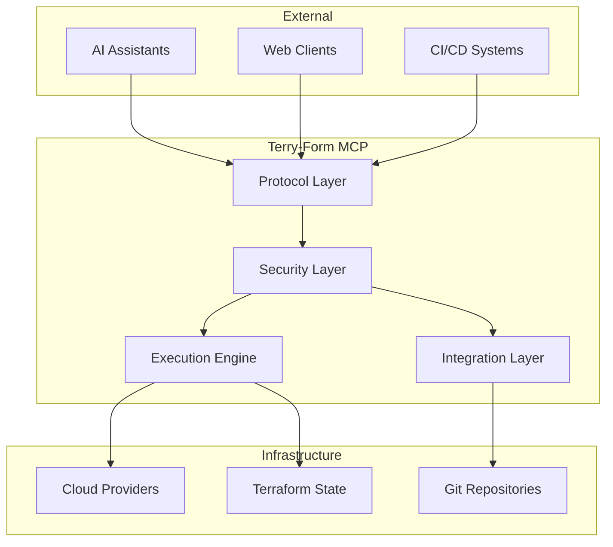
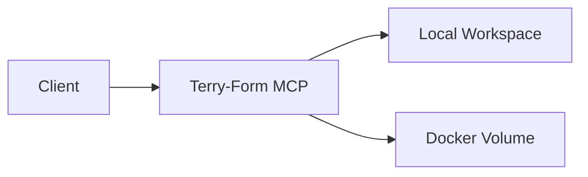
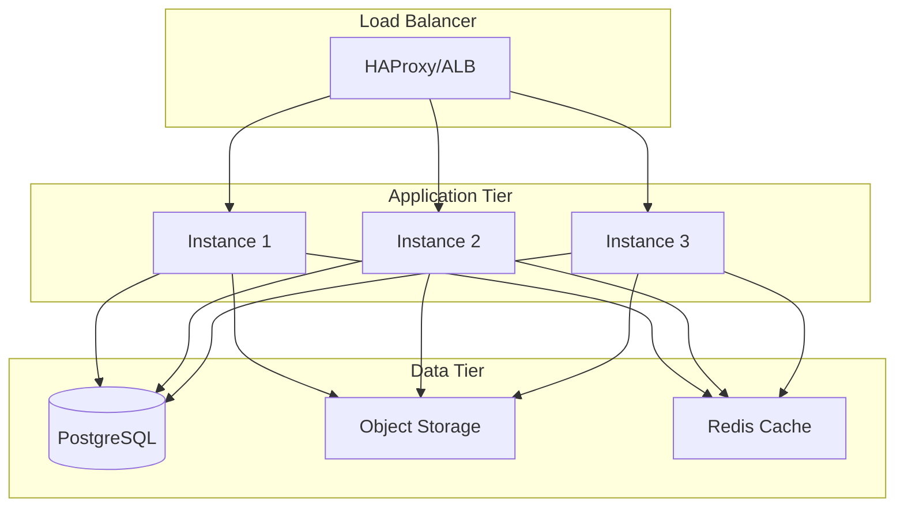
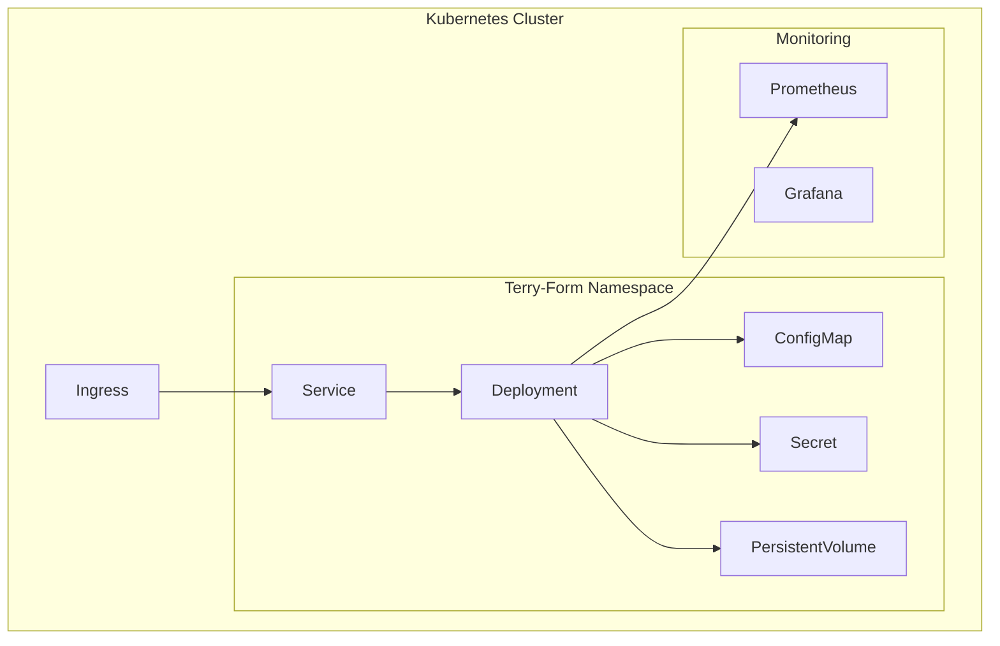
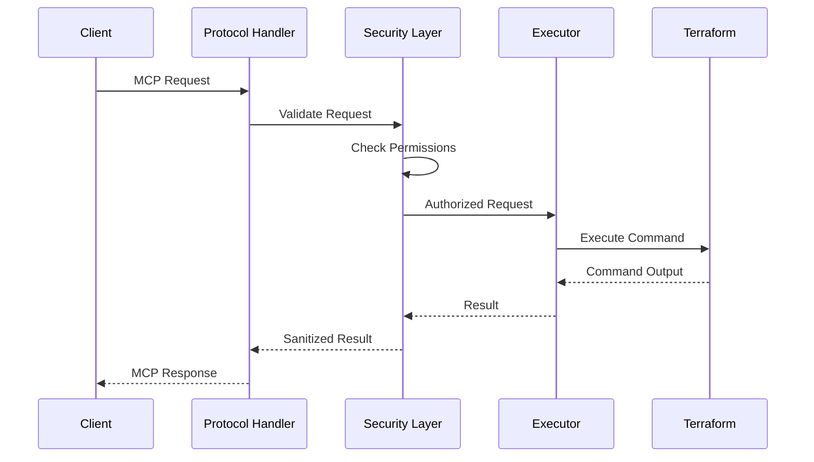

# Architecture Documentation

Explore the technical architecture of Terry-Form MCP.

  

  

## Architecture Documents


  

    
{{ doc.icon | default: "📄" }}

    <h3><a href="{{ doc.url | relative_url }}">{{ doc.title }}</a></h3>
    
{{ doc.description }}

    
    

      
      {{ topic }}
      
    

    
  



## Key Architectural Principles

### 🔒 Security First
Every component is designed with security as the primary concern. Defense in depth with multiple security layers.

### 📦 Modular Design
Components are loosely coupled and can be deployed independently. Easy to extend and maintain.

### 🚀 High Performance
Asynchronous operations, connection pooling, and intelligent caching for optimal performance.

### 🔄 Scalability
Horizontal scaling support with stateless components and shared state management.

### 🛡️ Fault Tolerance
Graceful error handling, circuit breakers, and automatic recovery mechanisms.

### 📊 Observable
Comprehensive logging, metrics, and tracing for full system visibility.

## Component Overview

  

    <h3>Protocol Layer</h3>
    
Handles MCP and HTTP communications

    <ul>
      <li>Request validation</li>
      <li>Response formatting</li>
      <li>Protocol translation</li>
    </ul>
  

  
  

    <h3>Security Layer</h3>
    
Enforces security policies

    <ul>
      <li>Authentication</li>
      <li>Authorization</li>
      <li>Input sanitization</li>
    </ul>
  

  
  

    <h3>Execution Engine</h3>
    
Manages Terraform operations

    <ul>
      <li>Command execution</li>
      <li>State management</li>
      <li>Resource isolation</li>
    </ul>
  

  
  

    <h3>Integration Layer</h3>
    
External service connections

    <ul>
      <li>GitHub API</li>
      <li>Cloud providers</li>
      <li>Terraform Cloud</li>
    </ul>
  

## Deployment Architectures

### Single Instance
Best for development and small teams.

### High Availability
For production environments.

### Kubernetes Native
Cloud-native deployment.

## Data Flow

### Request Processing

## Technology Stack

| Layer | Technology | Purpose |
|-------|------------|---------|
| Runtime | Python 3.9+ | Core application |
| Protocol | FastMCP | MCP implementation |
| Web Framework | aiohttp | Async HTTP server |
| Security | JWT, OAuth | Authentication |
| Container | Docker | Packaging |
| Orchestration | Kubernetes | Production deployment |
| IaC | Terraform | Infrastructure management |
| Monitoring | Prometheus/Grafana | Observability |

## Performance Characteristics

- **Request Latency**: < 100ms (p99)
- **Terraform Operations**: Depends on infrastructure size
- **Concurrent Operations**: 100+ per instance
- **Memory Usage**: ~512MB base
- **CPU Usage**: 0.5-2 cores typical

## Next Steps

- Review the [Architecture Overview]({{ site.baseurl }}/architecture/overview) for detailed component descriptions
- Additional architecture documents coming soon

