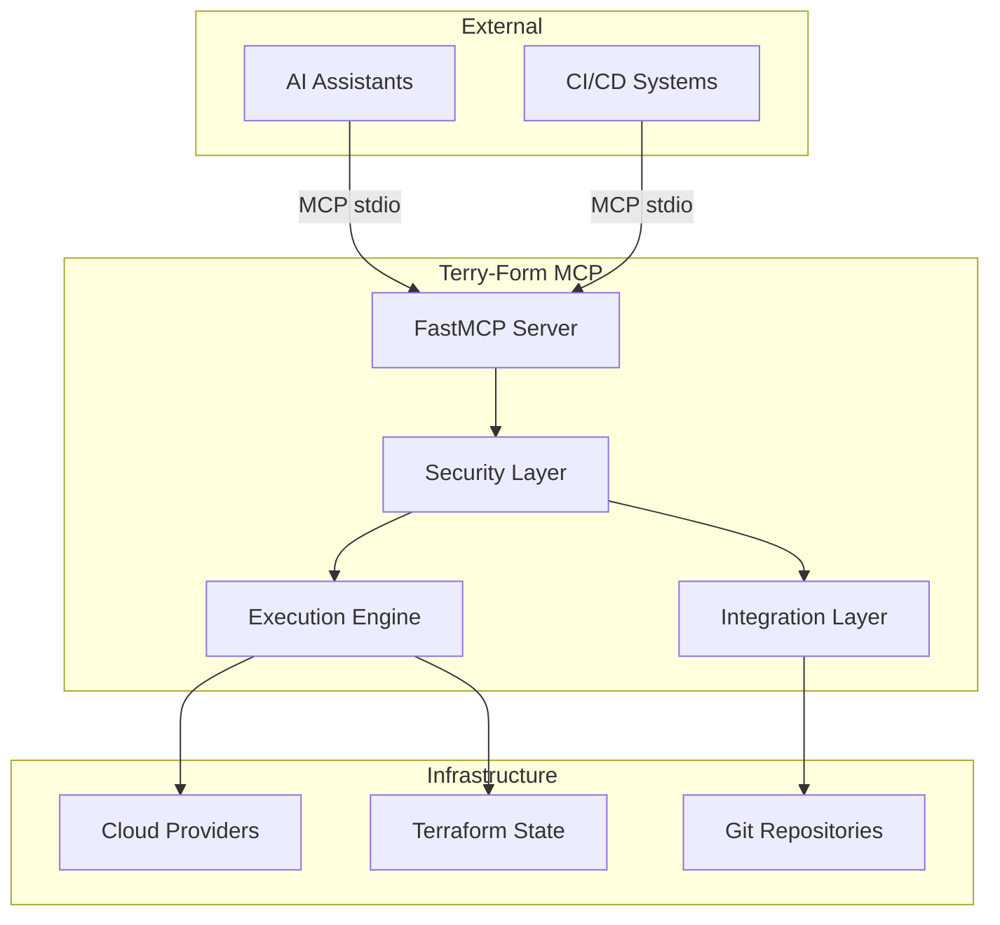

# Architecture Documentation

Explore the technical architecture of {{ site.data.project.docs_url | split: '/' | last | replace: '-', ' ' | capitalize }}.

```mermaid
graph TB
    subgraph External
        A[AI Assistants]
        C[CI/CD Systems]
    end

    subgraph "Terry-Form MCP"
        D[FastMCP Server]
        E[Security Layer]
        F[Execution Engine]
        G[Integration Layer]
    end

    subgraph Infrastructure
        H[Cloud Providers]
        I[Terraform State]
        J[Git Repositories]
    end

    A -->|MCP stdio| D
    C -->|MCP stdio| D
    D --> E
    E --> F
    E --> G
    F --> H
    F --> I
    G --> J
```

## Architecture Documents



  

    <h3><a href="{{ doc.url | relative_url }}">{{ doc.title }}</a></h3>
    
{{ doc.description }}

    
    

      
      {{ topic }}
      
    

    
  




## Key Architectural Principles

  

    <h3>Security First</h3>
    
Every component is designed with security as the primary concern. Defense in depth with multiple validation layers, path traversal protection, command injection prevention, and action whitelisting. Destructive operations (<code>apply</code>, <code>destroy</code>) are permanently blocked.

  

  

    <h3>Modular Design</h3>
    
Components are loosely coupled with clear responsibilities. The core Terraform executor, LSP client, GitHub handler, and security validator are independent modules registered through a single FastMCP entry point.

  

  

    <h3>Async Throughout</h3>
    
The server uses <code>asyncio</code> with FastMCP. All {{ site.data.project.tool_count }} tool handlers are async, enabling non-blocking I/O for Terraform subprocess execution, LSP communication, and external API calls.

  

## Component Overview

  

    <h3>Protocol Layer</h3>
    
Handles MCP stdio communication between AI assistants and the server

    <ul>
      <li>MCP stdio transport</li>
      <li>Tool registration via <code>@mcp.tool()</code></li>
      <li>Request/response formatting</li>
    </ul>
  

  

    <h3>Security Layer</h3>
    
Enforces security policies across all operations

    <ul>
      <li>Input validation and sanitization</li>
      <li>Path traversal protection</li>
      <li>Rate limiting ({{ site.data.project.rate_limits.terraform }}/{{ site.data.project.rate_limits.github }}/{{ site.data.project.rate_limits.default }} req/min)</li>
    </ul>
  

  

    <h3>Execution Engine</h3>
    
Manages Terraform operations safely within Docker

    <ul>
      <li>Terraform subprocess execution</li>
      <li>Workspace isolation at <code>/mnt/workspace</code></li>
      <li>Command whitelisting (init, validate, fmt, plan only)</li>
    </ul>
  

  

    <h3>Integration Layer</h3>
    
Connects to external services

    <ul>
      <li>GitHub API and App authentication</li>
      <li>Terraform Cloud workspaces and runs</li>
      <li>terraform-ls for LSP intelligence</li>
    </ul>
  

## Deployment Architecture

### Single Instance

Run as a Docker container connected to AI assistants via MCP stdio.

```mermaid
graph LR
    A[AI Assistant] -->|MCP stdio| B[Docker Container]
    B --> C[/mnt/workspace]
```

## Technology Stack

| Layer | Technology | Purpose |
|-------|------------|---------|
| Runtime | Python {{ site.data.project.python }} | Core application |
| Protocol | FastMCP {{ site.data.project.fastmcp }} | MCP server implementation |
| IaC | Terraform {{ site.data.project.terraform }} | Infrastructure management |
| LSP | terraform-ls {{ site.data.project.terraform_ls }} | Code intelligence |
| Container | Docker ({{ site.data.project.base_image }}) | Packaging and isolation |

## Next Steps

- Review the [Architecture Overview]({{ site.baseurl }}/architecture/overview) for detailed component descriptions
