# Architecture Overview

Terry-Form MCP is designed with security, scalability, and extensibility at its core. This document provides a comprehensive overview of the system architecture.

## System Architecture

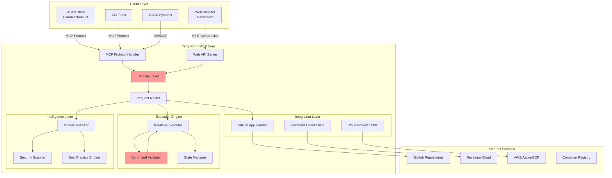

## Core Components

### 1. Protocol Layer

The protocol layer handles communication between clients and the Terry-Form server.

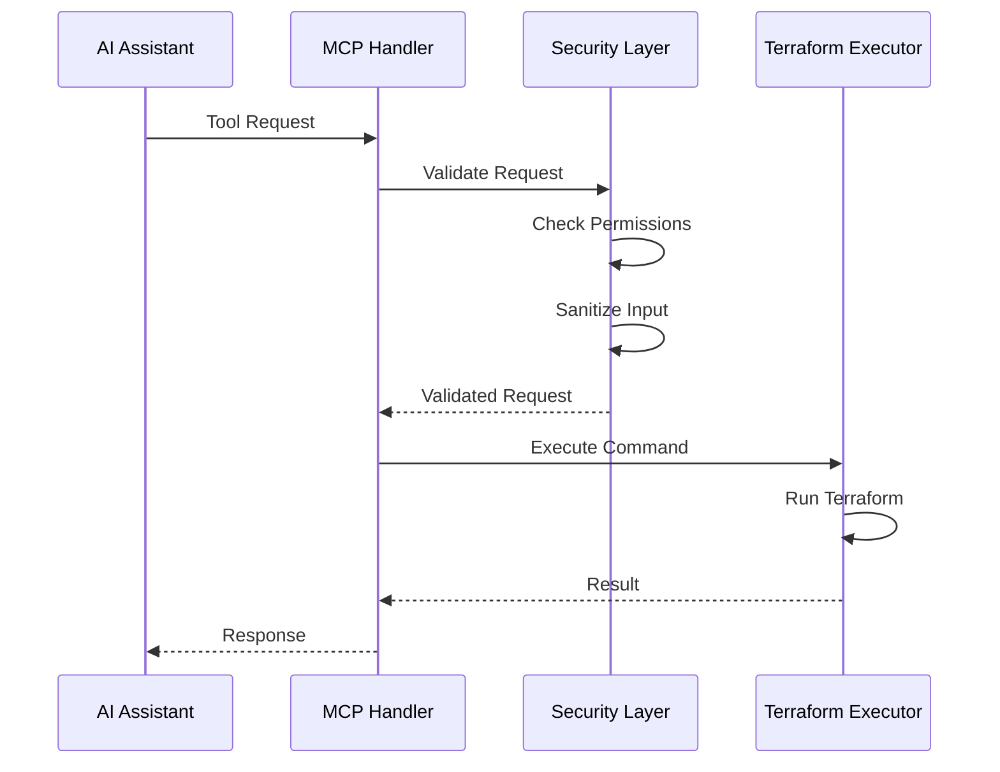

### 2. Security Architecture

Security is implemented in multiple layers:

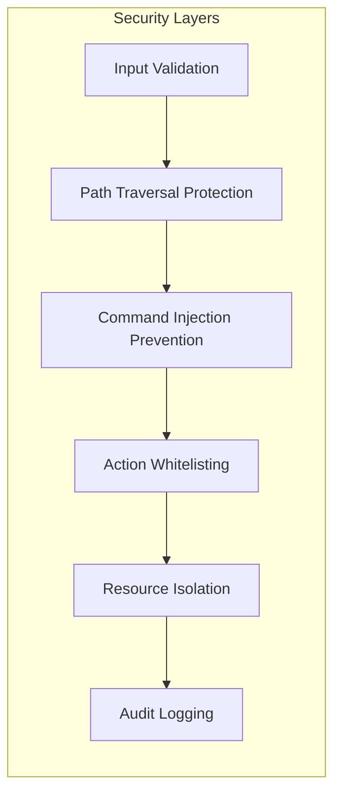

**Key Security Features:**

- **Input Validation**: All inputs are validated against strict schemas
- **Path Protection**: Prevents access outside designated workspace
- **Command Safety**: Uses `shell=False` and `shlex.quote()` for subprocess execution
- **Action Control**: Whitelist of allowed Terraform actions
- **Isolation**: Docker containers with limited capabilities

### 3. Execution Engine

The execution engine manages Terraform operations safely:

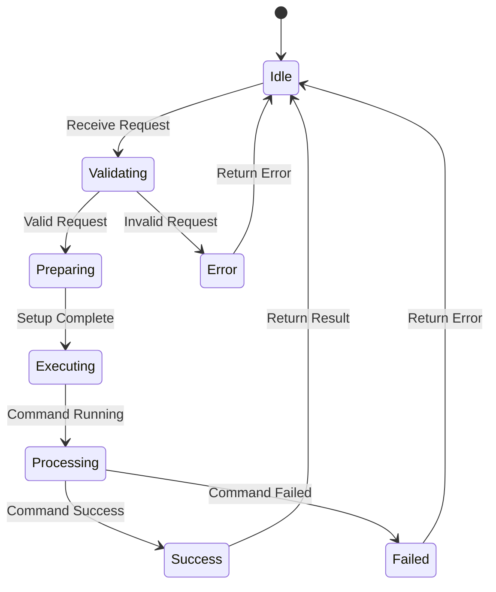

### 4. Data Flow

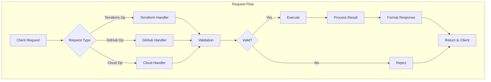

## Deployment Architecture

### Docker Deployment

```mermaid
graph TB
    subgraph "Docker Container"
        A[Terry-Form MCP]
        B[Python Runtime]
        C[Terraform Binary]
        D[Security Tools]
        E[Git Client]
    end
    
    subgraph "Volume Mounts"
        F[/mnt/workspace]
        G[/app/config]
        H[/var/log]
    end
    
    subgraph "Network"
        I[Port 3000: MCP]
        J[Port 8001: Web]
    end
    
    A --> F
    A --> G
    A --> H
    A --> I
    A --> J
```

### Kubernetes Architecture

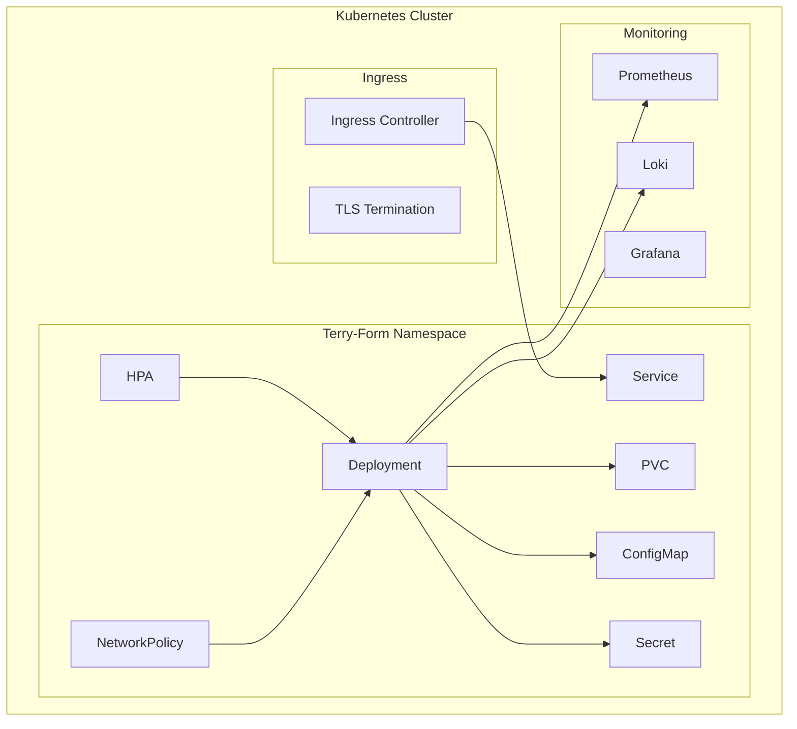

## Integration Architecture

### GitHub App Integration

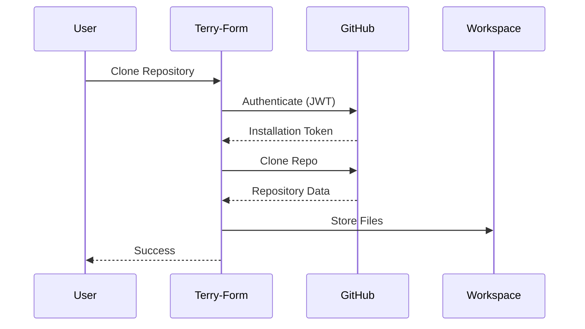

### Multi-Cloud Support

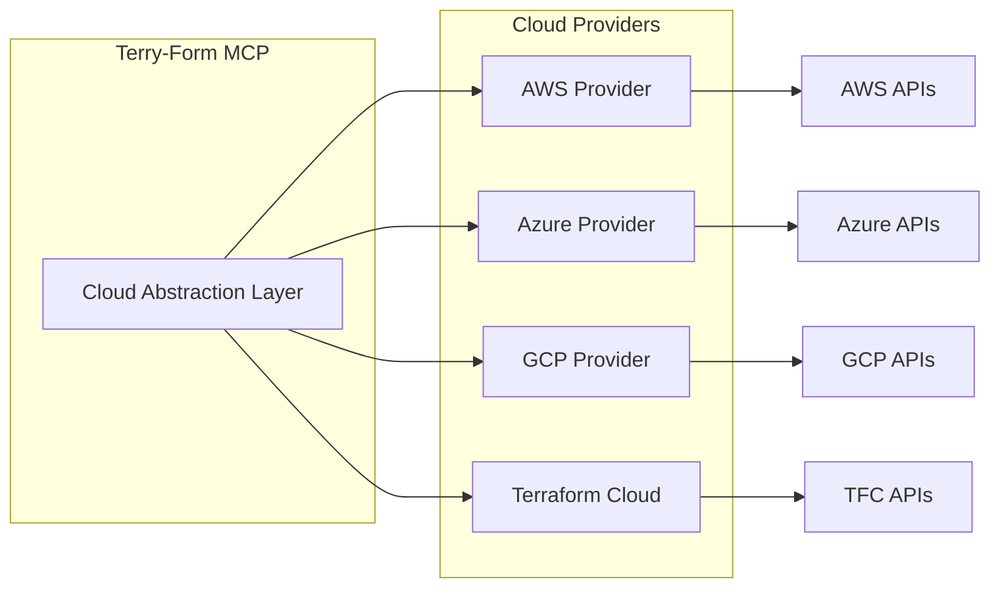

## Scalability Considerations

### Horizontal Scaling

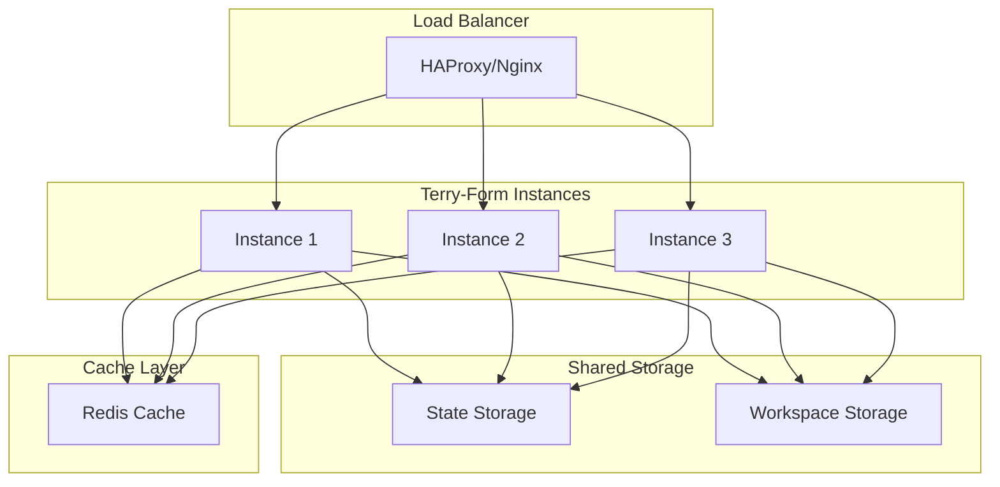

### Performance Optimization

- **Caching**: Module analysis results cached
- **Connection Pooling**: Reuse cloud provider connections
- **Async Operations**: Non-blocking I/O for better concurrency
- **Resource Limits**: CPU/Memory limits per operation

## Security Architecture Details

### Defense in Depth

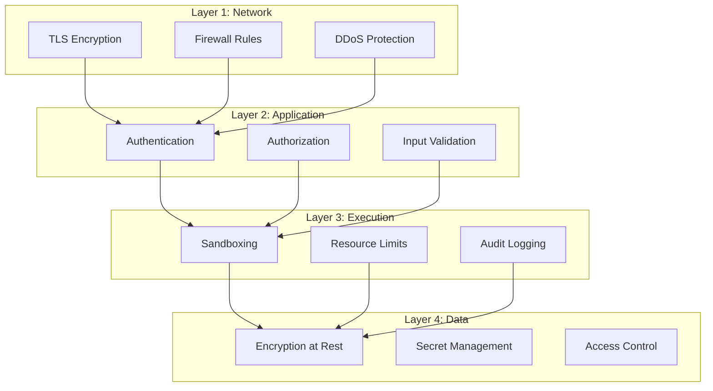

## Monitoring and Observability

### Metrics Collection

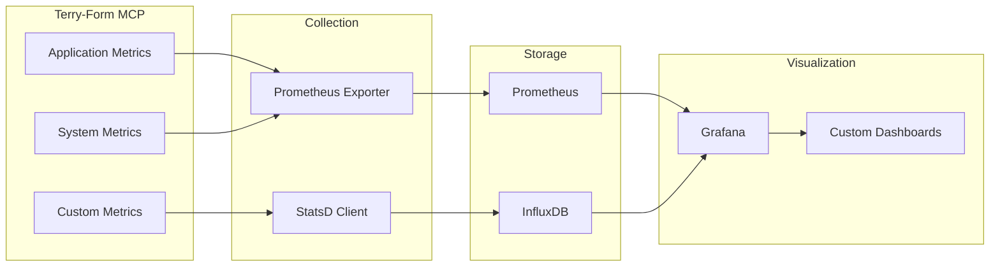

## High Availability Setup

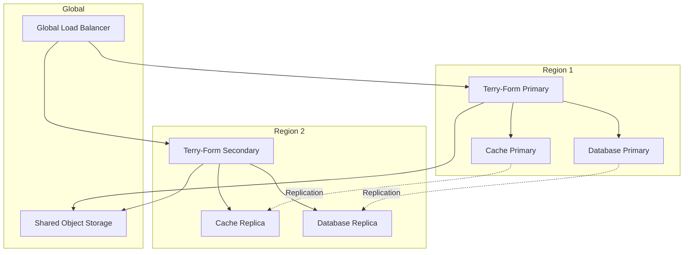

## Development Architecture

### Local Development Setup

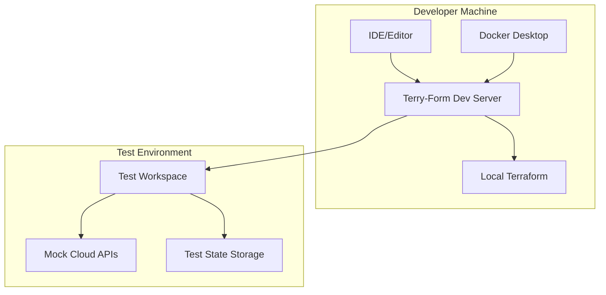

## Next Steps

- Review [Security Architecture]({{ site.baseurl }}/architecture/security) for detailed security implementation
- Explore [API Architecture]({{ site.baseurl }}/architecture/api) for API design patterns
- Learn about [Deployment Options]({{ site.baseurl }}/architecture/deployment) for production setups