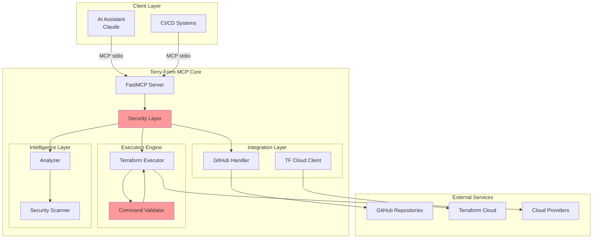
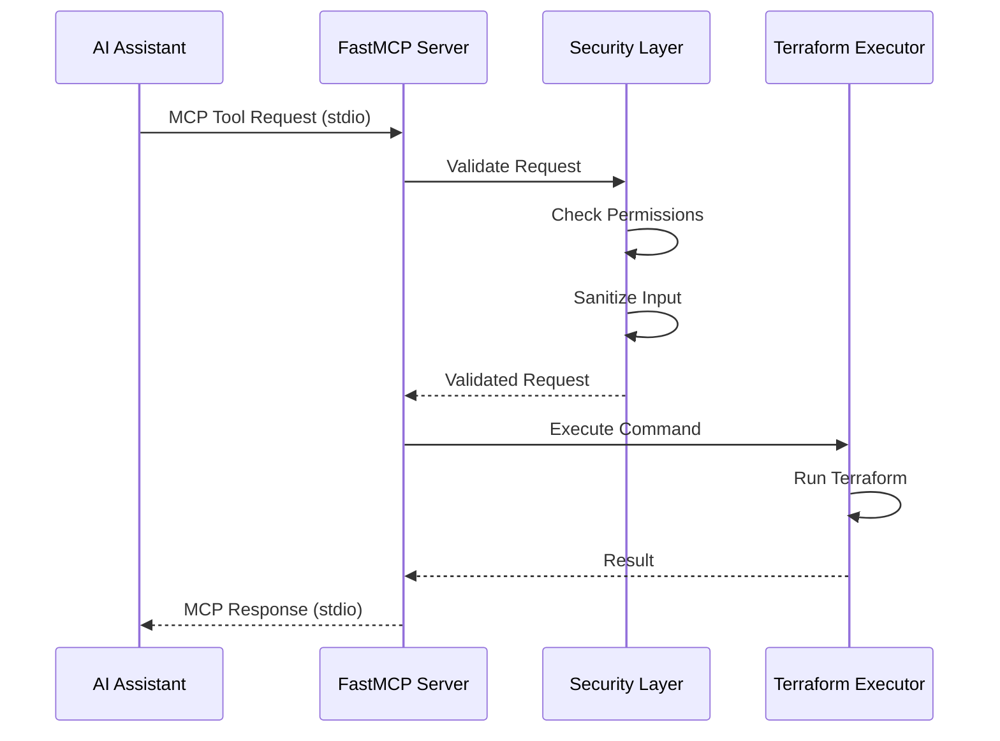
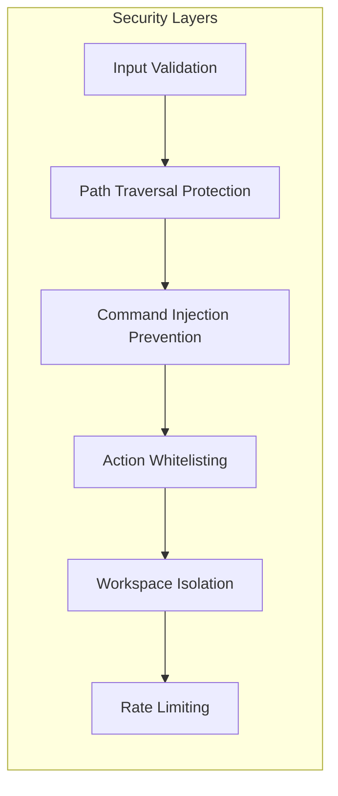
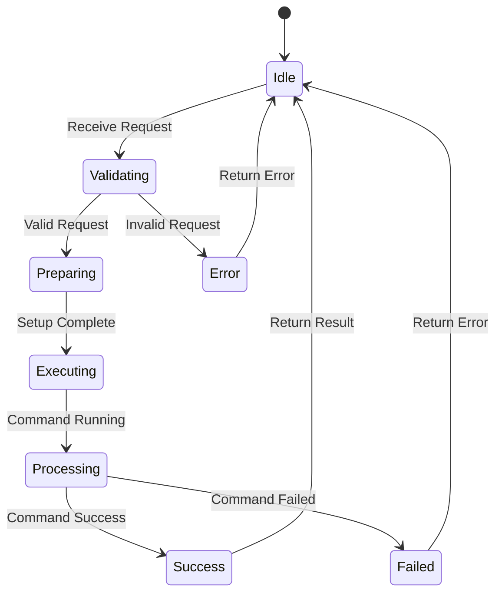
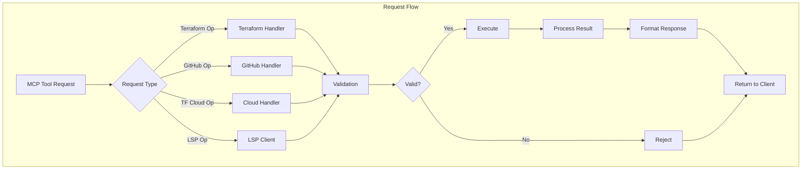
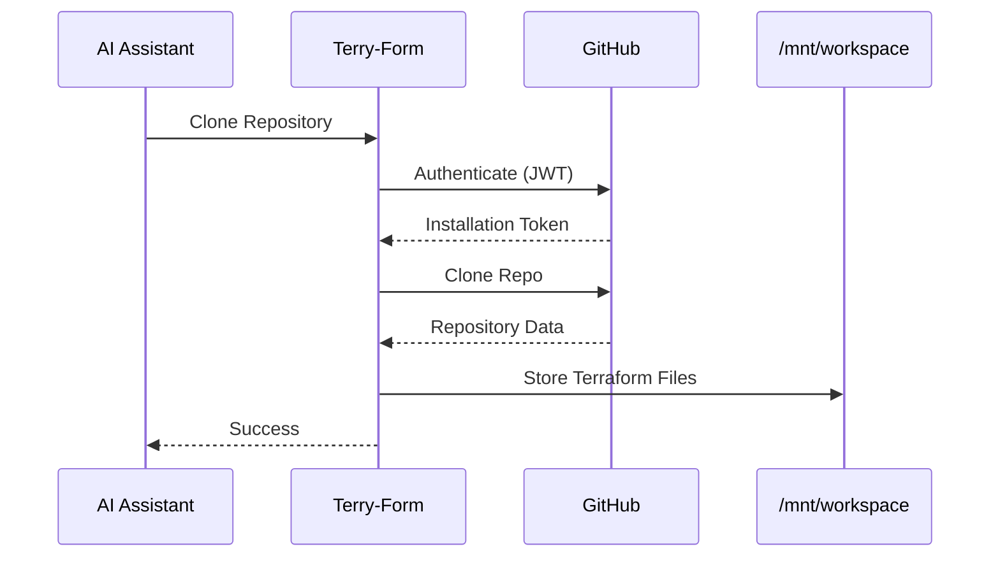

# Architecture Overview

Terry-Form MCP is designed with security, modularity, and async execution at its core. This document provides a comprehensive overview of the system architecture.

## System Architecture


```mermaid
graph TB
    subgraph "Client Layer"
        A[AI Assistant<br/>Claude]
        D[CI/CD Systems]
    end

    subgraph "Terry-Form MCP Core"
        E[FastMCP Server]
        G[Security Layer]

        subgraph "Execution Engine"
            I[Terraform Executor]
            J[Command Validator]
        end

        subgraph "Integration Layer"
            L[GitHub Handler]
            N[TF Cloud Client]
        end

        subgraph "Intelligence Layer"
            O[Analyzer]
            P[Security Scanner]
        end
    end

    subgraph "External Services"
        R[GitHub Repositories]
        S[Terraform Cloud]
        T[Cloud Providers]
    end

    A -->|MCP stdio| E
    D -->|MCP stdio| E

    E --> G

    G --> I
    G --> L
    G --> O

    I --> J
    J --> I

    L --> R
    N --> S
    I --> T

    O --> P

    style G fill:#ff9999
    style J fill:#ff9999
```

## Core Components

### 1. Protocol Layer

The protocol layer handles MCP stdio communication between AI assistants and the Terry-Form server. All {{ site.data.project.tool_count }} tools are registered via `@mcp.tool()` decorators on the FastMCP server.


```mermaid
sequenceDiagram
    participant Client as AI Assistant
    participant MCP as FastMCP Server
    participant Security as Security Layer
    participant Executor as Terraform Executor

    Client->>MCP: MCP Tool Request (stdio)
    MCP->>Security: Validate Request
    Security->>Security: Check Permissions
    Security->>Security: Sanitize Input
    Security-->>MCP: Validated Request
    MCP->>Executor: Execute Command
    Executor->>Executor: Run Terraform
    Executor-->>MCP: Result
    MCP-->>Client: MCP Response (stdio)
```

### 2. Security Architecture

Security is implemented in multiple layers, enforced by `mcp_request_validator.py`:


```mermaid
graph LR
    subgraph "Security Layers"
        A[Input Validation]
        B[Path Traversal Protection]
        C[Command Injection Prevention]
        D[Action Whitelisting]
        E[Workspace Isolation]
        F[Rate Limiting]
    end

    A --> B
    B --> C
    C --> D
    D --> E
    E --> F
```

**Key Security Features:**

- **Input Validation**: All inputs validated against strict JSON schemas
- **Path Protection**: Prevents access outside `/mnt/workspace`
- **Command Safety**: Uses `shell=False` and `shlex.quote()` for subprocess execution
- **Action Control**: Only `init`, `validate`, `fmt`, and `plan` are allowed -- `apply` and `destroy` are permanently blocked
- **Isolation**: Docker container running as non-root user `{{ site.data.project.container_user }}` (UID {{ site.data.project.container_uid }})
- **Rate Limiting**: {{ site.data.project.rate_limits.terraform }} req/min for Terraform, {{ site.data.project.rate_limits.github }} req/min for GitHub, {{ site.data.project.rate_limits.default }} req/min default

### 3. Execution Engine

The execution engine manages Terraform operations safely:


```mermaid
stateDiagram-v2
    [*] --> Idle
    Idle --> Validating: Receive Request
    Validating --> Preparing: Valid Request
    Validating --> Error: Invalid Request
    Preparing --> Executing: Setup Complete
    Executing --> Processing: Command Running
    Processing --> Success: Command Success
    Processing --> Failed: Command Failed
    Success --> Idle: Return Result
    Failed --> Idle: Return Error
    Error --> Idle: Return Error
```

**Forced Environment Variables:**

All Terraform subprocess calls include these environment variables to ensure safe automated execution:

- `TF_IN_AUTOMATION=true`
- `TF_INPUT=false`
- `CHECKPOINT_DISABLE=true`

### 4. Data Flow


```mermaid
graph TD
    subgraph "Request Flow"
        A[MCP Tool Request] --> B{Request Type}
        B -->|Terraform Op| C[Terraform Handler]
        B -->|GitHub Op| D[GitHub Handler]
        B -->|TF Cloud Op| E[Cloud Handler]
        B -->|LSP Op| X[LSP Client]

        C --> F[Validation]
        D --> F
        E --> F
        X --> F

        F --> G{Valid?}
        G -->|Yes| H[Execute]
        G -->|No| I[Reject]

        H --> J[Process Result]
        J --> K[Format Response]
        K --> L[Return to Client]
        I --> L
    end
```

## Deployment Architecture

### Docker Deployment

The container is built on `{{ site.data.project.base_image }}` (Alpine-based) and runs as non-root user `{{ site.data.project.container_user }}` (UID {{ site.data.project.container_uid }}). Communication uses MCP stdio -- there are no exposed ports.

```mermaid
graph TB
    subgraph "Docker Container"
        A[FastMCP Server]
        B[Python {{ site.data.project.python }}]
        C[Terraform {{ site.data.project.terraform }}]
        D[terraform-ls {{ site.data.project.terraform_ls }}]
        E[Git Client]
    end

    subgraph "Volume Mounts"
        F[/mnt/workspace]
    end

    A --> F
```

**Running the container:**

```bash
docker run -i --rm \
  -v "$(pwd):/mnt/workspace" \
  terry-form-mcp:latest
```

The `-i` flag enables stdin for MCP stdio communication. The workspace volume mount at `/mnt/workspace` provides access to Terraform configuration files.

## Integration Architecture

### GitHub App Integration


```mermaid
sequenceDiagram
    participant User as AI Assistant
    participant TerryForm as Terry-Form
    participant GitHub
    participant Workspace as /mnt/workspace

    User->>TerryForm: Clone Repository
    TerryForm->>GitHub: Authenticate (JWT)
    GitHub-->>TerryForm: Installation Token
    TerryForm->>GitHub: Clone Repo
    GitHub-->>TerryForm: Repository Data
    TerryForm->>Workspace: Store Terraform Files
    TerryForm-->>User: Success
```

### Terraform Cloud Integration

Terry-Form MCP includes {{ site.data.project.tools.terraform_cloud }} Terraform Cloud tools for managing workspaces and runs through the TFC API.

### LSP Intelligence

The terraform-ls integration provides {{ site.data.project.tools.lsp }} tools for code intelligence:

- Hover information for resources and attributes
- Auto-completions for Terraform configuration
- Diagnostics and error detection
- Code formatting
- Document symbols

The LSP client wraps `terraform-ls {{ site.data.project.terraform_ls }}` as an async subprocess. The first call may take 1-2 seconds for LSP initialization.

## Tool Categories

Terry-Form MCP exposes {{ site.data.project.tool_count }} tools organized into categories:

| Category | Count | Description |
|----------|-------|-------------|
| Core Terraform | {{ site.data.project.tools.core }} | init, validate, fmt, plan |
| LSP Intelligence | {{ site.data.project.tools.lsp }} | Hover, completions, diagnostics, formatting, symbols |
| Diagnostics | {{ site.data.project.tools.diagnostics }} | LSP diagnostics, file analysis, workspace inspection |
| Security | {{ site.data.project.tools.security }} | Security scanning, best practice recommendations |
| GitHub | {{ site.data.project.tools.github }} | Repository cloning, file extraction |
| Terraform Cloud | {{ site.data.project.tools.terraform_cloud }} | Workspace and run management |

## Next Steps

- Return to [Architecture Index]({{ site.baseurl }}/architecture/) for an overview
- Explore the [API Reference]({{ site.baseurl }}/api/) for detailed tool documentation
