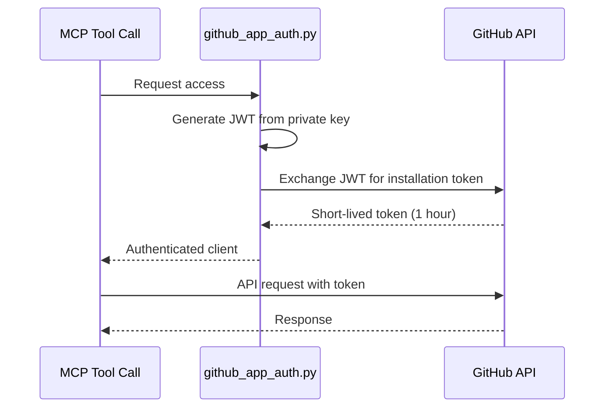

# GitHub Integration Guide

Terry-Form MCP integrates with GitHub via GitHub App authentication to clone repositories, list Terraform files, and prepare workspaces.

## Overview

4 GitHub tools are available:

| Tool | Description |
|------|-------------|
| `github_clone_repo` | Clone or update a GitHub repository |
| `github_list_terraform_files` | List `.tf` files in a cloned repo |
| `github_get_terraform_config` | Analyze Terraform config structure |
| `github_prepare_workspace` | Prepare a workspace from a repo |

## Prerequisites

GitHub integration requires a GitHub App. See the [GitHub App Setup Guide]({{ site.baseurl }}/GITHUB_APP_SETUP) for setup instructions.

Required environment variables:

```bash
export GITHUB_APP_ID="your-app-id"
export GITHUB_APP_INSTALLATION_ID="your-installation-id"
export GITHUB_APP_PRIVATE_KEY_PATH="/path/to/private-key.pem"
```

## Authentication Flow



The app uses PyJWT to generate JWTs and exchanges them for short-lived installation tokens. Tokens are cached and refreshed automatically.

## Cloning Repositories

Clone or update a repository into the workspace:

```json
{
  "tool": "github_clone_repo",
  "arguments": {
    "owner": "myorg",
    "repo": "infrastructure",
    "branch": "main",
    "force": false
  }
}
```

| Parameter | Type | Required | Description |
|-----------|------|----------|-------------|
| `owner` | string | Yes | Repository owner or organization |
| `repo` | string | Yes | Repository name |
| `branch` | string | No | Branch to clone (default branch if omitted) |
| `force` | boolean | No | Force update if already cloned |

Response:
```json
{
  "success": true,
  "action": "cloned",
  "path": "/mnt/workspace/github/myorg/infrastructure",
  "branch": "main"
}
```

## Listing Terraform Files

List `.tf` files in a cloned repository:

```json
{
  "tool": "github_list_terraform_files",
  "arguments": {
    "owner": "myorg",
    "repo": "infrastructure",
    "path": "environments/prod",
    "pattern": "*.tf"
  }
}
```

| Parameter | Type | Required | Description |
|-----------|------|----------|-------------|
| `owner` | string | Yes | Repository owner |
| `repo` | string | Yes | Repository name |
| `path` | string | No | Subdirectory to search |
| `pattern` | string | No | File pattern (default: `*.tf`) |

<div class="alert alert-warning">
<strong>Note</strong><br>
The repository must be cloned first with <code>github_clone_repo</code>. This tool searches the local clone, not the GitHub API directly.
</div>

## Analyzing Configuration

Get a structural analysis of Terraform configuration in a repo:

```json
{
  "tool": "github_get_terraform_config",
  "arguments": {
    "owner": "myorg",
    "repo": "infrastructure",
    "config_path": "environments/prod"
  }
}
```

Response:
```json
{
  "success": true,
  "repository": "myorg/infrastructure",
  "config_path": "environments/prod",
  "terraform_files": ["main.tf", "variables.tf", "outputs.tf"],
  "has_backend": true,
  "has_variables": true,
  "has_outputs": true,
  "providers": ["aws"],
  "modules": ["vpc", "rds"]
}
```

## Preparing Workspaces

Prepare a Terraform workspace from a GitHub repo for use with `terry`:

```json
{
  "tool": "github_prepare_workspace",
  "arguments": {
    "owner": "myorg",
    "repo": "infrastructure",
    "config_path": "environments/prod",
    "workspace_name": "prod-review"
  }
}
```

This clones the repo (if not already cloned) and creates an isolated workspace that can be used with the `terry` tool.

Response:
```json
{
  "success": true,
  "workspace_path": "/mnt/workspace/terraform-workspaces/prod-review",
  "workspace_name": "prod-review",
  "source": {
    "repository": "myorg/infrastructure",
    "config_path": "environments/prod"
  }
}
```

## Complete Workflow

A typical GitHub-to-Terraform workflow:

1. **Clone**: `github_clone_repo` to get the repository
2. **Explore**: `github_list_terraform_files` to find configurations
3. **Analyze**: `github_get_terraform_config` to understand structure
4. **Prepare**: `github_prepare_workspace` to create a workspace
5. **Execute**: `terry` with `["init", "validate", "plan"]` on the workspace

## Rate Limits

| Limit | Value |
|-------|-------|
| Terry-Form internal | {{ site.data.project.rate_limits.github }} requests/minute |
| GitHub API (per installation) | 5,000 requests/hour |

## Security Considerations

- **Read-only access**: The GitHub App should only have read permissions
- **Short-lived tokens**: Installation tokens expire after 1 hour
- **Repository scoping**: Install the app only on repositories you need
- **Private key security**: Never commit the PEM file to version control
- **Audit logging**: Review GitHub App activity in your audit log
