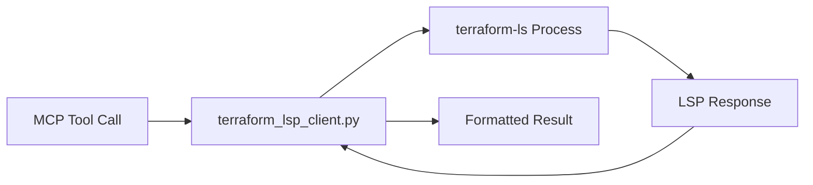

# LSP Integration Guide

Terry-Form MCP includes a full Language Server Protocol (LSP) client that wraps terraform-ls {{ site.data.project.terraform_ls }}. This provides intelligent code features for Terraform files.

## Overview

The LSP integration provides 5 tools:

| Tool | Description |
|------|-------------|
| `terraform_validate_lsp` | Validate a file using LSP diagnostics |
| `terraform_hover` | Get documentation at a cursor position |
| `terraform_complete` | Get code completion suggestions |
| `terraform_format_lsp` | Format a Terraform file |
| `terraform_lsp_status` | Check LSP server status |

Plus 2 diagnostic tools:

| Tool | Description |
|------|-------------|
| `terry_lsp_init` | Manually initialize LSP for a workspace |
| `terry_lsp_debug` | Debug LSP functionality |

## How It Works



The LSP client:
1. Spawns a `terraform-ls serve` subprocess
2. Communicates via JSON-RPC over stdio
3. Initializes the workspace root
4. Processes requests (hover, complete, validate, format)
5. Returns structured results

<div class="alert alert-info">
<strong>Initialization Latency</strong><br>
The first LSP call may take 1-2 seconds while terraform-ls initializes and indexes the workspace. Subsequent calls are faster.
</div>

## Validating Files

Get LSP diagnostics for a Terraform file:

```json
{
  "tool": "terraform_validate_lsp",
  "arguments": {
    "file_path": "main.tf",
    "workspace_path": "my-project"
  }
}
```

Response:
```json
{
  "file_path": "main.tf",
  "diagnostics": [
    {
      "range": {
        "start": {"line": 10, "character": 5},
        "end": {"line": 10, "character": 15}
      },
      "severity": "error",
      "message": "Unknown resource type 'aws_s3_buckt'"
    }
  ],
  "valid": false
}
```

## Hover Documentation

Get documentation for any symbol at a specific position:

```json
{
  "tool": "terraform_hover",
  "arguments": {
    "file_path": "main.tf",
    "line": 5,
    "character": 10,
    "workspace_path": "my-project"
  }
}
```

Positions are 0-based (first line = 0, first character = 0).

Returns provider documentation, attribute descriptions, and type information.

## Code Completions

Get completion suggestions at a cursor position:

```json
{
  "tool": "terraform_complete",
  "arguments": {
    "file_path": "main.tf",
    "line": 12,
    "character": 4,
    "workspace_path": "my-project"
  }
}
```

Response:
```json
{
  "completions": [
    {
      "label": "instance_type",
      "kind": "Property",
      "detail": "string",
      "documentation": "The instance type to use",
      "insertText": "instance_type = \"${1:t3.micro}\""
    }
  ]
}
```

## Formatting

Format a Terraform file according to HCL standards:

```json
{
  "tool": "terraform_format_lsp",
  "arguments": {
    "file_path": "main.tf",
    "workspace_path": "my-project"
  }
}
```

Returns edit instructions that were applied to the file.

## LSP Status

Check the current state of the LSP server:

```json
{"tool": "terraform_lsp_status"}
```

Response:
```json
{
  "status": "active",
  "initialized": true,
  "capabilities": ["completion", "hover", "validation", "formatting"],
  "workspace_root": "/mnt/workspace/my-project"
}
```

## Initialization

The LSP client initializes automatically on the first LSP tool call. To manually initialize for a specific workspace:

```json
{
  "tool": "terry_lsp_init",
  "arguments": {
    "workspace_path": "my-project"
  }
}
```

## Debugging

If LSP features aren't working, use the debug tool:

```json
{"tool": "terry_lsp_debug"}
```

This checks:
- terraform-ls binary availability and version
- LSP client state (initialized, workspace, process active)
- terraform-ls help output

## Troubleshooting

### LSP Not Initializing

1. Check terraform-ls is installed: `terry_environment_check`
2. Ensure workspace has `.tf` files
3. Try manual init: `terry_lsp_init` with the workspace path
4. Check debug output: `terry_lsp_debug`

### Slow Responses

- First call takes 1-2 seconds for initialization
- Large workspaces with many modules take longer
- Ensure `init` has been run on the workspace first

### No Completions

- Completions require an initialized workspace (run `terry` with `init` first)
- Ensure the cursor position is valid (0-based line and character)
- Check that the file exists and is readable: `terry_file_check`

### Wrong Workspace

The LSP client uses a single workspace root. If you switch between workspaces, re-initialize with `terry_lsp_init` for the new workspace.
