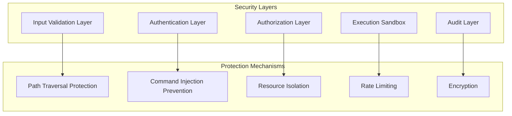
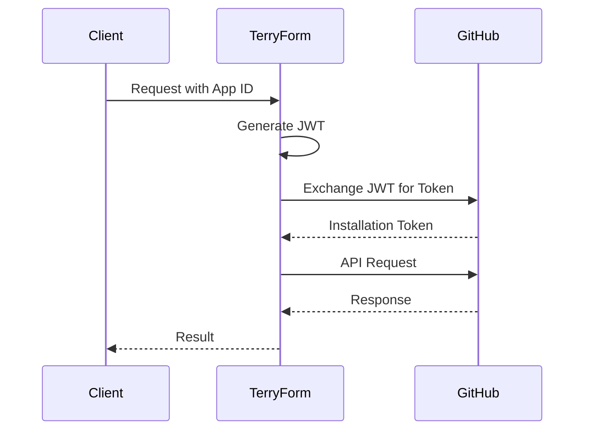

# Security Guide

Terry-Form MCP is built with security as a core principle. This guide covers security features, best practices, and configuration options.

## Security Architecture



## Built-in Security Features

### 1. Input Validation

All inputs are validated using strict schemas:

```python
# Example validation schema
{
    "path": {
        "type": "string",
        "pattern": "^[a-zA-Z0-9/_-]+$",
        "maxLength": 255
    },
    "actions": {
        "type": "array",
        "items": {
            "enum": ["init", "validate", "plan", "fmt"]
        }
    }
}
```

### 2. Path Traversal Protection

Terry-Form prevents access outside the designated workspace:

```python
def validate_path(path: str) -> bool:
    # Resolve to absolute path
    abs_path = Path(workspace_root) / path
    real_path = abs_path.resolve()
    
    # Ensure path is within workspace
    try:
        real_path.relative_to(workspace_root)
        return True
    except ValueError:
        return False
```

### 3. Command Injection Prevention

All subprocess executions use secure patterns:

```python
# Secure command execution
subprocess.run(
    ["terraform", action, *args],
    shell=False,  # Never use shell=True
    cwd=workspace_path,
    capture_output=True
)

# Variable escaping
import shlex
safe_value = shlex.quote(str(value))
```

### 4. Action Whitelisting

Only safe Terraform actions are allowed by default:

```yaml
allowed_actions:
  - init
  - validate
  - plan
  - fmt
  - show
  - graph
  - providers
  - version

blocked_actions:
  - apply      # Requires explicit override
  - destroy    # Requires explicit override
  - import     # Can modify state
  - taint      # Can modify state
```

## Authentication & Authorization

### GitHub App Authentication



Configuration:

```yaml
github:
  app_id: ${GITHUB_APP_ID}
  private_key_path: /secrets/github-app.pem
  webhook_secret: ${GITHUB_WEBHOOK_SECRET}
  permissions:
    contents: read
    metadata: read
    pull_requests: write
```

### API Key Authentication

For web endpoints:

```javascript
// API key validation
const apiKey = request.headers['x-api-key'];
if (!apiKey || !isValidApiKey(apiKey)) {
    return response.status(401).json({ error: 'Unauthorized' });
}
```

## Secure Configuration

### Environment Variables

```bash
# Required security environment variables
export WORKSPACE_ROOT="/mnt/workspace"
export ALLOWED_WORKSPACE_PATHS="/mnt/workspace"
export MAX_OPERATION_TIMEOUT=300
export ENABLE_APPLY=false
export ENABLE_DESTROY=false

# Secrets (use secret management)
export TERRAFORM_CLOUD_TOKEN="${SECRET_TF_TOKEN}"
export GITHUB_APP_PRIVATE_KEY="${SECRET_GH_KEY}"
export API_ENCRYPTION_KEY="${SECRET_API_KEY}"
```

### Docker Security

```dockerfile
# Run as non-root user
USER terraform:terraform

# Drop capabilities
RUN setcap -r /usr/bin/terraform

# Read-only root filesystem
VOLUME ["/mnt/workspace"]
```

Docker run options:

```bash
docker run \
  --security-opt=no-new-privileges \
  --cap-drop=ALL \
  --read-only \
  --tmpfs /tmp \
  -v workspace:/mnt/workspace:rw \
  terry-form-mcp
```

### Kubernetes Security

```yaml
apiVersion: v1
kind: Pod
spec:
  securityContext:
    runAsNonRoot: true
    runAsUser: 1000
    fsGroup: 1000
    seccompProfile:
      type: RuntimeDefault
  containers:
  - name: terry-form
    securityContext:
      allowPrivilegeEscalation: false
      readOnlyRootFilesystem: true
      capabilities:
        drop:
        - ALL
    resources:
      limits:
        cpu: "2"
        memory: "2Gi"
      requests:
        cpu: "500m"
        memory: "512Mi"
```

## Network Security

### TLS Configuration

```yaml
tls:
  enabled: true
  min_version: "1.2"
  ciphers:
    - TLS_ECDHE_RSA_WITH_AES_256_GCM_SHA384
    - TLS_ECDHE_RSA_WITH_AES_128_GCM_SHA256
  cert_file: /certs/tls.crt
  key_file: /certs/tls.key
```

### Network Policies

```yaml
apiVersion: networking.k8s.io/v1
kind: NetworkPolicy
metadata:
  name: terry-form-network-policy
spec:
  podSelector:
    matchLabels:
      app: terry-form
  policyTypes:
  - Ingress
  - Egress
  ingress:
  - from:
    - podSelector:
        matchLabels:
          role: api-gateway
    ports:
    - protocol: TCP
      port: 3000
  egress:
  - to:
    - namespaceSelector:
        matchLabels:
          name: kube-system
    ports:
    - protocol: TCP
      port: 53  # DNS
  - to:
    - podSelector: {}
    ports:
    - protocol: TCP
      port: 443  # HTTPS
```

## Secret Management

### Using HashiCorp Vault

```python
import hvac

client = hvac.Client(url='https://vault.example.com')
client.token = os.environ['VAULT_TOKEN']

# Read secrets
secrets = client.read('secret/terry-form')
terraform_token = secrets['data']['terraform_cloud_token']
github_key = secrets['data']['github_app_key']
```

### Using Kubernetes Secrets

```yaml
apiVersion: v1
kind: Secret
metadata:
  name: terry-form-secrets
type: Opaque
data:
  terraform-cloud-token: <base64-encoded-token>
  github-app-key: <base64-encoded-key>
---
apiVersion: v1
kind: Pod
spec:
  containers:
  - name: terry-form
    env:
    - name: TERRAFORM_CLOUD_TOKEN
      valueFrom:
        secretKeyRef:
          name: terry-form-secrets
          key: terraform-cloud-token
```

## Audit Logging

### Structured Logging

```json
{
  "timestamp": "2024-01-15T10:30:45Z",
  "level": "INFO",
  "event": "terraform_operation",
  "user": "ai-assistant-1",
  "action": "plan",
  "workspace": "production",
  "source_ip": "10.0.0.100",
  "duration": 12.5,
  "success": true,
  "resources_affected": 5
}
```

### Audit Trail Configuration

```yaml
audit:
  enabled: true
  destinations:
    - type: file
      path: /var/log/terry-form/audit.log
      rotation: daily
      retention: 90
    - type: syslog
      host: syslog.example.com
      port: 514
      protocol: tcp
    - type: elasticsearch
      url: https://elastic.example.com
      index: terry-form-audit
```

## Security Scanning

### Container Scanning

```bash
# Scan Docker image
trivy image aj-geddes/terry-form-mcp:latest

# Scan running container
docker run --rm \
  -v /var/run/docker.sock:/var/run/docker.sock \
  aquasec/trivy container terry-form
```

### Code Security Analysis

```bash
# Python security scan
bandit -r . -ll

# Dependency scanning
safety check

# SAST scanning
semgrep --config=auto .
```

## Incident Response

### Security Incident Procedure

1. **Detection**: Monitor logs and alerts
2. **Containment**: Isolate affected components
3. **Investigation**: Analyze audit logs
4. **Remediation**: Apply fixes
5. **Recovery**: Restore normal operations
6. **Post-mortem**: Document and improve

### Emergency Shutdown

```bash
# Immediate shutdown
kubectl delete deployment terry-form-mcp --grace-period=0

# Revoke all tokens
terry-form-cli security revoke-all-tokens

# Block network access
iptables -A INPUT -p tcp --dport 3000 -j DROP
```

## Security Checklist

- [ ] Enable TLS for all communications
- [ ] Configure authentication (API keys/OAuth)
- [ ] Set up proper RBAC policies
- [ ] Enable audit logging
- [ ] Configure secret management
- [ ] Implement rate limiting
- [ ] Set resource limits
- [ ] Enable security scanning
- [ ] Configure network policies
- [ ] Set up monitoring and alerting
- [ ] Document incident response procedures
- [ ] Regular security updates
- [ ] Vulnerability scanning
- [ ] Penetration testing
- [ ] Security training

## Compliance

### SOC 2 Compliance

Terry-Form MCP supports SOC 2 compliance:

- **Security**: Encryption, access controls, monitoring
- **Availability**: HA deployment, backup procedures
- **Processing Integrity**: Input validation, audit trails
- **Confidentiality**: Secret management, data isolation
- **Privacy**: Data minimization, retention policies

### GDPR Compliance

- No personal data collection by default
- Audit logs can be configured to exclude PII
- Data retention policies configurable
- Right to erasure supported

## Security Resources

- [OWASP Top 10](https://owasp.org/www-project-top-ten/)
- [CIS Benchmarks](https://www.cisecurity.org/cis-benchmarks/)
- [NIST Cybersecurity Framework](https://www.nist.gov/cyberframework)
- [Security Updates]({{ site.baseurl }}/security-updates)

---

<div class="alert alert-info">
<strong>Security Contact</strong><br>
For security issues, please email: security@terry-form.io<br>
PGP Key: <a href="{{ site.baseurl }}/security.asc">Download</a>
</div>