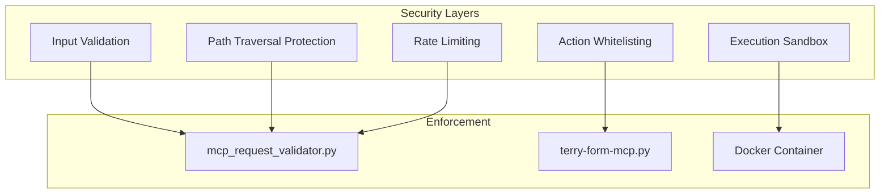
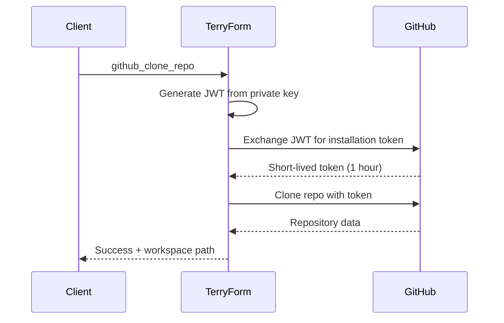

# Security Guide

Terry-Form MCP is built with security as a core principle. This guide covers the security features, best practices, and configuration options.

## Security Architecture


```mermaid
graph TB
    subgraph "Security Layers"
        A[Input Validation]
        B[Path Traversal Protection]
        C[Action Whitelisting]
        D[Execution Sandbox]
        E[Rate Limiting]
    end

    subgraph "Enforcement"
        F[mcp_request_validator.py]
        G[terry-form-mcp.py]
        H[Docker Container]
    end

    A --> F
    B --> F
    C --> G
    D --> H
    E --> F
```

## Built-in Security Features

### 1. Input Validation

All inputs are validated by `mcp_request_validator.py` using strict schemas:

```python
# Validation enforced on every tool call via @validate_request decorator
{
    "path": {
        "type": "string",
        "pattern": "^[a-zA-Z0-9/_-]+$",
        "maxLength": 255
    },
    "actions": {
        "type": "array",
        "items": {
            "enum": ["init", "validate", "plan", "fmt", "show", "graph", "providers", "version"]
        }
    }
}
```

Dangerous characters in variable values are blocked to prevent injection attacks.

### 2. Path Traversal Protection

Terry-Form prevents access outside the designated workspace (`/mnt/workspace`):

```python
def validate_path(path: str) -> bool:
    abs_path = Path(workspace_root) / path
    real_path = abs_path.resolve()

    try:
        real_path.relative_to(workspace_root)
        return True
    except ValueError:
        return False  # Path traversal detected
```

Attempts to use `../`, symbolic links, or absolute paths outside the workspace are rejected.

### 3. Command Injection Prevention

All subprocess executions use secure patterns:

```python
# Secure command execution - never uses shell=True
subprocess.run(
    ["terraform", action, *args],
    shell=False,
    cwd=workspace_path,
    capture_output=True,
    env=safe_env
)
```

### 4. Action Whitelisting

Only safe Terraform actions are allowed. Destructive operations are permanently blocked:

```yaml
allowed_actions:
  - init
  - validate
  - plan
  - fmt
  - show
  - graph
  - providers
  - version

blocked_actions:  # Cannot be overridden
  - apply
  - destroy
  - import
  - taint
  - untaint
```

### 5. Forced Environment Variables

These are always set inside the container and cannot be overridden:

| Variable | Value | Purpose |
|----------|-------|---------|
| `TF_IN_AUTOMATION` | `true` | Suppresses interactive prompts |
| `TF_INPUT` | `false` | Prevents Terraform from asking for input |
| `CHECKPOINT_DISABLE` | `true` | Disables Terraform update checks |

### 6. Rate Limiting

Internal rate limiting protects against abuse:

| Operation Type | Limit | Window |
|---------------|-------|--------|
| Terraform operations | {{ site.data.project.rate_limits.terraform }} requests | 1 minute |
| GitHub operations | {{ site.data.project.rate_limits.github }} requests | 1 minute |
| Terraform Cloud | {{ site.data.project.rate_limits.tf_cloud }} requests | 1 minute |
| Default | {{ site.data.project.rate_limits.default }} requests | 1 minute |

## Authentication

### GitHub App Authentication


```mermaid
sequenceDiagram
    participant Client
    participant TerryForm
    participant GitHub

    Client->>TerryForm: github_clone_repo
    TerryForm->>TerryForm: Generate JWT from private key
    TerryForm->>GitHub: Exchange JWT for installation token
    GitHub-->>TerryForm: Short-lived token (1 hour)
    TerryForm->>GitHub: Clone repo with token
    GitHub-->>TerryForm: Repository data
    TerryForm-->>Client: Success + workspace path
```

Required environment variables:

| Variable | Purpose |
|----------|---------|
| `GITHUB_APP_ID` | Your GitHub App's ID |
| `GITHUB_APP_INSTALLATION_ID` | Installation ID for target account |
| `GITHUB_APP_PRIVATE_KEY` or `GITHUB_APP_PRIVATE_KEY_PATH` | RSA private key (PEM format) |

See the [GitHub App Setup Guide]({{ site.baseurl }}/GITHUB_APP_SETUP) for detailed configuration.

### Terraform Cloud Authentication

Set the `TF_CLOUD_TOKEN` environment variable with your Terraform Cloud API token.

## Docker Security

### Container Hardening

The Docker image is built on `{{ site.data.project.base_image }}` (Alpine-based) and runs as a non-root user:

```dockerfile
# Non-root user (UID {{ site.data.project.container_uid }})
USER {{ site.data.project.container_user }}:{{ site.data.project.container_user }}
```

### Recommended Docker Run Options

```bash
docker run -i --rm \
  --security-opt=no-new-privileges \
  --cap-drop=ALL \
  --read-only \
  --tmpfs /tmp \
  -v /path/to/workspace:/mnt/workspace:rw \
  terry-form-mcp:latest
```

| Option | Purpose |
|--------|---------|
| `--security-opt=no-new-privileges` | Prevent privilege escalation |
| `--cap-drop=ALL` | Drop all Linux capabilities |
| `--read-only` | Read-only root filesystem |
| `--tmpfs /tmp` | Writable temp directory |
| `-v ...:rw` | Only workspace is writable |

### Cloud Credential Passthrough

Only specific credential environment variables are allowed:

**AWS**: `AWS_ACCESS_KEY_ID`, `AWS_SECRET_ACCESS_KEY`, `AWS_SESSION_TOKEN`, `AWS_DEFAULT_REGION`, `AWS_REGION`, `AWS_PROFILE`

**Google Cloud**: `GOOGLE_CREDENTIALS`, `GOOGLE_APPLICATION_CREDENTIALS`, `GOOGLE_PROJECT`, `GOOGLE_REGION`, `GOOGLE_ZONE`

**Azure**: `ARM_CLIENT_ID`, `ARM_CLIENT_SECRET`, `ARM_SUBSCRIPTION_ID`, `ARM_TENANT_ID`

**Terraform Cloud**: `TF_TOKEN_app_terraform_io`, `TERRAFORM_CLOUD_TOKEN`

## Secret Management

### Best Practices

1. **Never commit secrets** to version control
2. **Use environment variables** to pass credentials to the Docker container
3. **Mount key files as read-only** (`:ro` flag)
4. **Use short-lived tokens** where possible (GitHub App installation tokens expire after 1 hour)

### Example with Secret Files

```bash
docker run -i --rm \
  -v /path/to/workspace:/mnt/workspace \
  -v /secrets/github-app.pem:/keys/github-app.pem:ro \
  -e GITHUB_APP_PRIVATE_KEY_PATH=/keys/github-app.pem \
  -e GITHUB_APP_ID=12345 \
  -e GITHUB_APP_INSTALLATION_ID=67890 \
  terry-form-mcp:latest
```

## Security Scanning

### Built-in Security Scanner

Terry-Form MCP includes a built-in security scanner (`terry_security_scan`) that checks for:

- Public S3 bucket ACLs (CKV_AWS_20)
- Missing S3 encryption (CKV_AWS_19)
- Overly permissive security groups (CKV_AWS_24)
- Unencrypted RDS instances (CKV_AWS_16)
- IAM wildcard permissions (CKV_AWS_1)

### Container Image Scanning

Scan the Docker image for vulnerabilities:

```bash
# Using Trivy
trivy image terry-form-mcp:latest

# Using Docker Scout
docker scout cves terry-form-mcp:latest
```

### Code Security

```bash
# Python security scan
bandit -r . -ll

# Dependency scanning
pip-audit
```

## Security Checklist

- [ ] Run as non-root user (UID {{ site.data.project.container_uid }})
- [ ] Drop all Linux capabilities (`--cap-drop=ALL`)
- [ ] Use read-only root filesystem
- [ ] Mount workspace with minimal permissions
- [ ] Pass credentials via environment variables, not files
- [ ] Enable rate limiting (enabled by default)
- [ ] Scan container image for vulnerabilities
- [ ] Review Terraform configurations with `terry_security_scan`
- [ ] Use GitHub App tokens instead of personal access tokens
- [ ] Regularly update the Docker image

## Security Contact

For security issues, please open an issue on [GitHub]({{ site.data.project.repo_url }}/issues/new).
