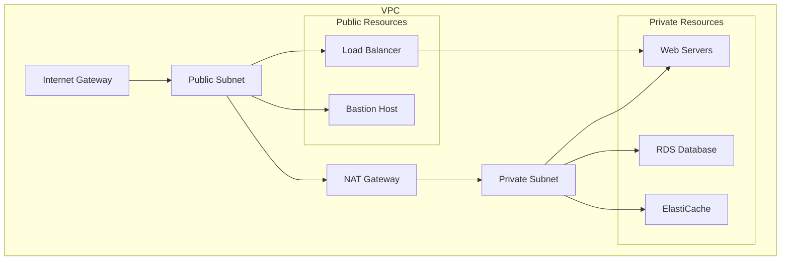

# Building AWS Infrastructure with Terry-Form MCP

In this tutorial, you'll learn how to use Terry-Form MCP to build and manage AWS infrastructure safely through an AI assistant.

## Prerequisites

- Terry-Form MCP installed and running
- AWS account with credentials configured
- Basic understanding of Terraform
- AI assistant configured with Terry-Form MCP

## What We'll Build



## Step 1: Project Setup

First, let's create a project structure:

```bash
workspace/
├── aws-tutorial/
│   ├── main.tf
│   ├── variables.tf
│   ├── outputs.tf
│   └── terraform.tfvars.example
```

Ask your AI assistant:

> "Please create a new Terraform workspace at 'aws-tutorial' with basic AWS provider configuration"

The assistant will use Terry-Form to create:

**main.tf:**
```hcl
terraform {
  required_version = ">= 1.0"
  
  required_providers {
    aws = {
      source  = "hashicorp/aws"
      version = "~> 5.0"
    }
  }
}

provider "aws" {
  region = var.aws_region
  
  default_tags {
    tags = {
      Project     = var.project_name
      Environment = var.environment
      ManagedBy   = "Terraform"
    }
  }
}
```

**variables.tf:**
```hcl
variable "aws_region" {
  description = "AWS region for resources"
  type        = string
  default     = "us-east-1"
}

variable "project_name" {
  description = "Name of the project"
  type        = string
  default     = "terry-form-tutorial"
}

variable "environment" {
  description = "Environment name"
  type        = string
  default     = "dev"
}

variable "vpc_cidr" {
  description = "CIDR block for VPC"
  type        = string
  default     = "10.0.0.0/16"
}
```

## Step 2: Create VPC Infrastructure

Ask your AI assistant:

> "Add a VPC with public and private subnets across 2 availability zones to my aws-tutorial workspace"

The assistant will create:

**vpc.tf:**
```hcl
# Get available AZs
data "aws_availability_zones" "available" {
  state = "available"
}

# VPC
resource "aws_vpc" "main" {
  cidr_block           = var.vpc_cidr
  enable_dns_hostnames = true
  enable_dns_support   = true

  tags = {
    Name = "${var.project_name}-vpc"
  }
}

# Internet Gateway
resource "aws_internet_gateway" "main" {
  vpc_id = aws_vpc.main.id

  tags = {
    Name = "${var.project_name}-igw"
  }
}

# Public Subnets
resource "aws_subnet" "public" {
  count = 2

  vpc_id                  = aws_vpc.main.id
  cidr_block              = cidrsubnet(var.vpc_cidr, 8, count.index)
  availability_zone       = data.aws_availability_zones.available.names[count.index]
  map_public_ip_on_launch = true

  tags = {
    Name = "${var.project_name}-public-${count.index + 1}"
    Type = "public"
  }
}

# Private Subnets
resource "aws_subnet" "private" {
  count = 2

  vpc_id            = aws_vpc.main.id
  cidr_block        = cidrsubnet(var.vpc_cidr, 8, count.index + 10)
  availability_zone = data.aws_availability_zones.available.names[count.index]

  tags = {
    Name = "${var.project_name}-private-${count.index + 1}"
    Type = "private"
  }
}

# Elastic IP for NAT Gateway
resource "aws_eip" "nat" {
  count  = 1
  domain = "vpc"

  tags = {
    Name = "${var.project_name}-nat-eip"
  }
}

# NAT Gateway
resource "aws_nat_gateway" "main" {
  count = 1

  allocation_id = aws_eip.nat[0].id
  subnet_id     = aws_subnet.public[0].id

  tags = {
    Name = "${var.project_name}-nat"
  }

  depends_on = [aws_internet_gateway.main]
}

# Route Tables
resource "aws_route_table" "public" {
  vpc_id = aws_vpc.main.id

  route {
    cidr_block = "0.0.0.0/0"
    gateway_id = aws_internet_gateway.main.id
  }

  tags = {
    Name = "${var.project_name}-public-rt"
  }
}

resource "aws_route_table" "private" {
  vpc_id = aws_vpc.main.id

  route {
    cidr_block     = "0.0.0.0/0"
    nat_gateway_id = aws_nat_gateway.main[0].id
  }

  tags = {
    Name = "${var.project_name}-private-rt"
  }
}

# Route Table Associations
resource "aws_route_table_association" "public" {
  count = length(aws_subnet.public)

  subnet_id      = aws_subnet.public[count.index].id
  route_table_id = aws_route_table.public.id
}

resource "aws_route_table_association" "private" {
  count = length(aws_subnet.private)

  subnet_id      = aws_subnet.private[count.index].id
  route_table_id = aws_route_table.private.id
}
```

## Step 3: Initialize and Plan

Ask your AI assistant:

> "Initialize and validate my aws-tutorial Terraform configuration"

Expected response:

```json
{
  "terry-results": [
    {
      "action": "init",
      "success": true,
      "stdout": "Terraform has been successfully initialized!"
    },
    {
      "action": "validate",
      "success": true,
      "stdout": "Success! The configuration is valid."
    }
  ]
}
```

Now create a plan:

> "Generate a Terraform plan for aws-tutorial with environment=dev"

## Step 4: Add Security Groups

Ask your AI assistant:

> "Add security groups for a web application with ALB, web servers, and RDS database"

**security_groups.tf:**
```hcl
# ALB Security Group
resource "aws_security_group" "alb" {
  name_prefix = "${var.project_name}-alb-"
  description = "Security group for Application Load Balancer"
  vpc_id      = aws_vpc.main.id

  ingress {
    from_port   = 80
    to_port     = 80
    protocol    = "tcp"
    cidr_blocks = ["0.0.0.0/0"]
    description = "HTTP from anywhere"
  }

  ingress {
    from_port   = 443
    to_port     = 443
    protocol    = "tcp"
    cidr_blocks = ["0.0.0.0/0"]
    description = "HTTPS from anywhere"
  }

  egress {
    from_port   = 0
    to_port     = 0
    protocol    = "-1"
    cidr_blocks = ["0.0.0.0/0"]
    description = "Allow all outbound"
  }

  tags = {
    Name = "${var.project_name}-alb-sg"
  }
}

# Web Server Security Group
resource "aws_security_group" "web" {
  name_prefix = "${var.project_name}-web-"
  description = "Security group for web servers"
  vpc_id      = aws_vpc.main.id

  ingress {
    from_port       = 80
    to_port         = 80
    protocol        = "tcp"
    security_groups = [aws_security_group.alb.id]
    description     = "HTTP from ALB"
  }

  egress {
    from_port   = 0
    to_port     = 0
    protocol    = "-1"
    cidr_blocks = ["0.0.0.0/0"]
    description = "Allow all outbound"
  }

  tags = {
    Name = "${var.project_name}-web-sg"
  }
}

# RDS Security Group
resource "aws_security_group" "rds" {
  name_prefix = "${var.project_name}-rds-"
  description = "Security group for RDS database"
  vpc_id      = aws_vpc.main.id

  ingress {
    from_port       = 3306
    to_port         = 3306
    protocol        = "tcp"
    security_groups = [aws_security_group.web.id]
    description     = "MySQL from web servers"
  }

  tags = {
    Name = "${var.project_name}-rds-sg"
  }
}
```

## Step 5: Add Application Resources

Ask your AI assistant:

> "Add an Application Load Balancer and Auto Scaling Group for web servers"

**alb.tf:**
```hcl
# Application Load Balancer
resource "aws_lb" "main" {
  name               = "${var.project_name}-alb"
  internal           = false
  load_balancer_type = "application"
  security_groups    = [aws_security_group.alb.id]
  subnets            = aws_subnet.public[*].id

  enable_deletion_protection = false
  enable_http2              = true

  tags = {
    Name = "${var.project_name}-alb"
  }
}

# Target Group
resource "aws_lb_target_group" "web" {
  name     = "${var.project_name}-web-tg"
  port     = 80
  protocol = "HTTP"
  vpc_id   = aws_vpc.main.id

  health_check {
    enabled             = true
    healthy_threshold   = 2
    unhealthy_threshold = 2
    timeout             = 5
    interval            = 30
    path                = "/health"
    matcher             = "200"
  }

  tags = {
    Name = "${var.project_name}-web-tg"
  }
}

# ALB Listener
resource "aws_lb_listener" "web" {
  load_balancer_arn = aws_lb.main.arn
  port              = 80
  protocol          = "HTTP"

  default_action {
    type             = "forward"
    target_group_arn = aws_lb_target_group.web.arn
  }
}
```

## Step 6: Review and Analyze

Ask your AI assistant:

> "Analyze my aws-tutorial configuration for security best practices"

The assistant will use Terry-Form's analysis tools:

```json
{
  "analysis": {
    "score": 85,
    "issues": [
      {
        "severity": "warning",
        "type": "security",
        "message": "ALB is not using HTTPS listener",
        "recommendation": "Add HTTPS listener with SSL certificate"
      },
      {
        "severity": "info",
        "type": "cost",
        "message": "NAT Gateway incurs hourly charges",
        "recommendation": "Consider NAT instances for dev environments"
      }
    ]
  }
}
```

## Step 7: Cost Estimation

Ask your AI assistant:

> "Can you estimate the monthly cost for this infrastructure?"

**Approximate AWS Costs:**

| Resource | Count | Monthly Cost |
|----------|-------|--------------|
| VPC | 1 | $0 |
| NAT Gateway | 1 | ~$45 |
| ALB | 1 | ~$22 |
| t3.micro instances | 2 | ~$15 |
| RDS db.t3.micro | 1 | ~$15 |
| **Total** | | **~$97/month** |

## Step 8: Outputs

Add outputs to see important values:

**outputs.tf:**
```hcl
output "alb_dns_name" {
  description = "DNS name of the load balancer"
  value       = aws_lb.main.dns_name
}

output "vpc_id" {
  description = "ID of the VPC"
  value       = aws_vpc.main.id
}

output "public_subnet_ids" {
  description = "IDs of public subnets"
  value       = aws_subnet.public[*].id
}

output "private_subnet_ids" {
  description = "IDs of private subnets"
  value       = aws_subnet.private[*].id
}
```

## Best Practices Demonstrated

1. **Multi-AZ Deployment**: Resources spread across availability zones
2. **Network Isolation**: Public/private subnet separation
3. **Security Groups**: Least privilege access
4. **Tagging Strategy**: Consistent resource tagging
5. **Modular Design**: Separated into logical files

## Cleanup

When you're done experimenting:

> "Generate a plan to destroy all resources in aws-tutorial"

<div class="alert alert-warning">
<strong>⚠️ Important</strong><br>
Terry-Form MCP blocks <code>destroy</code> operations by default. This is intentional for safety. To destroy resources, you'll need to run Terraform directly or enable destroy in Terry-Form's configuration.
</div>

## Next Steps

1. **Add HTTPS**: Configure ACM certificate and HTTPS listener
2. **Add RDS**: Create a managed database instance
3. **Add Monitoring**: CloudWatch alarms and dashboards
4. **Add Backup**: Automated snapshots and retention
5. **Add CI/CD**: Integrate with deployment pipeline

## Advanced Topics

### Using Terraform Modules

```hcl
module "vpc" {
  source = "terraform-aws-modules/vpc/aws"
  version = "5.0.0"

  name = var.project_name
  cidr = var.vpc_cidr

  azs             = data.aws_availability_zones.available.names
  private_subnets = [for i in range(2) : cidrsubnet(var.vpc_cidr, 8, i + 10)]
  public_subnets  = [for i in range(2) : cidrsubnet(var.vpc_cidr, 8, i)]

  enable_nat_gateway = true
  single_nat_gateway = true
}
```

### State Management

```hcl
terraform {
  backend "s3" {
    bucket = "my-terraform-state"
    key    = "aws-tutorial/terraform.tfstate"
    region = "us-east-1"
    
    dynamodb_table = "terraform-state-lock"
    encrypt        = true
  }
}
```

## Summary

In this tutorial, you learned how to:

✅ Create a VPC with public/private subnets  
✅ Configure security groups  
✅ Set up an Application Load Balancer  
✅ Use Terry-Form MCP for safe Terraform operations  
✅ Analyze configurations for best practices  

## Resources

- [AWS Terraform Provider Docs](https://registry.terraform.io/providers/hashicorp/aws/latest/docs)
- [Terraform Best Practices](https://www.terraform.io/docs/cloud/guides/recommended-practices/index.html)
- [AWS Well-Architected Framework](https://aws.amazon.com/architecture/well-architected/)

---

<div class="tutorial-nav">
  <a href="{{ site.baseurl }}/tutorials/" class="btn">← Back to Tutorials</a>
  <a href="{{ site.baseurl }}/tutorials/multi-cloud" class="btn btn-primary">Next: Multi-Cloud Setup →</a>
</div>