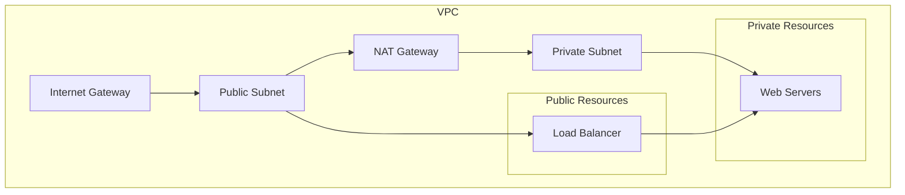

# Building AWS Infrastructure

In this tutorial, you'll use Terry-Form MCP to build and validate a complete AWS networking setup — VPC, subnets, security groups, and an Application Load Balancer.

## What You'll Build


```mermaid
graph TB
    subgraph "VPC"
        A[Internet Gateway]
        B[Public Subnet]
        C[Private Subnet]
        D[NAT Gateway]

        subgraph "Public Resources"
            E[Load Balancer]
        end

        subgraph "Private Resources"
            G[Web Servers]
        end
    end

    A --> B
    B --> D
    D --> C
    B --> E
    C --> G
    E --> G
```

## Step 1: Project Setup

Create a project structure in your workspace:

```
workspace/
└── aws-tutorial/
    ├── main.tf
    ├── variables.tf
    ├── vpc.tf
    ├── security_groups.tf
    ├── alb.tf
    └── outputs.tf
```

Ask your AI assistant:

> "Create a new Terraform project at aws-tutorial with AWS provider configuration"

**main.tf:**
```hcl
terraform {
  required_version = ">= 1.0"

  required_providers {
    aws = {
      source  = "hashicorp/aws"
      version = "~> 5.0"
    }
  }
}

provider "aws" {
  region = var.aws_region

  default_tags {
    tags = {
      Project     = var.project_name
      Environment = var.environment
      ManagedBy   = "Terraform"
    }
  }
}
```

**variables.tf:**
```hcl
variable "aws_region" {
  description = "AWS region for resources"
  type        = string
  default     = "us-east-1"
}

variable "project_name" {
  description = "Name of the project"
  type        = string
  default     = "terry-form-tutorial"
}

variable "environment" {
  description = "Environment name"
  type        = string
  default     = "dev"
}

variable "vpc_cidr" {
  description = "CIDR block for VPC"
  type        = string
  default     = "10.0.0.0/16"
}
```

## Step 2: Create VPC Infrastructure

Ask your AI assistant:

> "Add a VPC with public and private subnets across 2 availability zones to my aws-tutorial workspace"

**vpc.tf:**
```hcl
data "aws_availability_zones" "available" {
  state = "available"
}

resource "aws_vpc" "main" {
  cidr_block           = var.vpc_cidr
  enable_dns_hostnames = true
  enable_dns_support   = true

  tags = {
    Name = "${var.project_name}-vpc"
  }
}

resource "aws_internet_gateway" "main" {
  vpc_id = aws_vpc.main.id

  tags = {
    Name = "${var.project_name}-igw"
  }
}

resource "aws_subnet" "public" {
  count = 2

  vpc_id                  = aws_vpc.main.id
  cidr_block              = cidrsubnet(var.vpc_cidr, 8, count.index)
  availability_zone       = data.aws_availability_zones.available.names[count.index]
  map_public_ip_on_launch = true

  tags = {
    Name = "${var.project_name}-public-${count.index + 1}"
    Type = "public"
  }
}

resource "aws_subnet" "private" {
  count = 2

  vpc_id            = aws_vpc.main.id
  cidr_block        = cidrsubnet(var.vpc_cidr, 8, count.index + 10)
  availability_zone = data.aws_availability_zones.available.names[count.index]

  tags = {
    Name = "${var.project_name}-private-${count.index + 1}"
    Type = "private"
  }
}

resource "aws_eip" "nat" {
  count  = 1
  domain = "vpc"

  tags = {
    Name = "${var.project_name}-nat-eip"
  }
}

resource "aws_nat_gateway" "main" {
  count = 1

  allocation_id = aws_eip.nat[0].id
  subnet_id     = aws_subnet.public[0].id

  tags = {
    Name = "${var.project_name}-nat"
  }

  depends_on = [aws_internet_gateway.main]
}

resource "aws_route_table" "public" {
  vpc_id = aws_vpc.main.id

  route {
    cidr_block = "0.0.0.0/0"
    gateway_id = aws_internet_gateway.main.id
  }

  tags = {
    Name = "${var.project_name}-public-rt"
  }
}

resource "aws_route_table" "private" {
  vpc_id = aws_vpc.main.id

  route {
    cidr_block     = "0.0.0.0/0"
    nat_gateway_id = aws_nat_gateway.main[0].id
  }

  tags = {
    Name = "${var.project_name}-private-rt"
  }
}

resource "aws_route_table_association" "public" {
  count = length(aws_subnet.public)

  subnet_id      = aws_subnet.public[count.index].id
  route_table_id = aws_route_table.public.id
}

resource "aws_route_table_association" "private" {
  count = length(aws_subnet.private)

  subnet_id      = aws_subnet.private[count.index].id
  route_table_id = aws_route_table.private.id
}
```

## Step 3: Initialize and Plan

Ask your AI assistant:

> "Initialize and validate my aws-tutorial Terraform configuration"

Expected response:

```json
{
  "terry-results": [
    {
      "action": "init",
      "success": true,
      "stdout": "Terraform has been successfully initialized!"
    },
    {
      "action": "validate",
      "success": true,
      "stdout": "Success! The configuration is valid."
    }
  ]
}
```

Now create a plan:

> "Generate a Terraform plan for aws-tutorial with environment=dev"

```json
{
  "tool": "terry",
  "arguments": {
    "path": "aws-tutorial",
    "actions": ["plan"],
    "vars": {"environment": "dev"}
  }
}
```

## Step 4: Add Security Groups

Ask your AI assistant:

> "Add security groups for a web application with ALB, web servers, and RDS database"

**security_groups.tf:**
```hcl
resource "aws_security_group" "alb" {
  name_prefix = "${var.project_name}-alb-"
  description = "Security group for Application Load Balancer"
  vpc_id      = aws_vpc.main.id

  ingress {
    from_port   = 80
    to_port     = 80
    protocol    = "tcp"
    cidr_blocks = ["0.0.0.0/0"]
    description = "HTTP from anywhere"
  }

  ingress {
    from_port   = 443
    to_port     = 443
    protocol    = "tcp"
    cidr_blocks = ["0.0.0.0/0"]
    description = "HTTPS from anywhere"
  }

  egress {
    from_port   = 0
    to_port     = 0
    protocol    = "-1"
    cidr_blocks = ["0.0.0.0/0"]
    description = "Allow all outbound"
  }

  tags = {
    Name = "${var.project_name}-alb-sg"
  }
}

resource "aws_security_group" "web" {
  name_prefix = "${var.project_name}-web-"
  description = "Security group for web servers"
  vpc_id      = aws_vpc.main.id

  ingress {
    from_port       = 80
    to_port         = 80
    protocol        = "tcp"
    security_groups = [aws_security_group.alb.id]
    description     = "HTTP from ALB"
  }

  egress {
    from_port   = 0
    to_port     = 0
    protocol    = "-1"
    cidr_blocks = ["0.0.0.0/0"]
    description = "Allow all outbound"
  }

  tags = {
    Name = "${var.project_name}-web-sg"
  }
}

resource "aws_security_group" "rds" {
  name_prefix = "${var.project_name}-rds-"
  description = "Security group for RDS database"
  vpc_id      = aws_vpc.main.id

  ingress {
    from_port       = 3306
    to_port         = 3306
    protocol        = "tcp"
    security_groups = [aws_security_group.web.id]
    description     = "MySQL from web servers"
  }

  tags = {
    Name = "${var.project_name}-rds-sg"
  }
}
```

## Step 5: Add Application Load Balancer

Ask your AI assistant:

> "Add an Application Load Balancer with a target group and HTTP listener"

**alb.tf:**
```hcl
resource "aws_lb" "main" {
  name               = "${var.project_name}-alb"
  internal           = false
  load_balancer_type = "application"
  security_groups    = [aws_security_group.alb.id]
  subnets            = aws_subnet.public[*].id

  enable_deletion_protection = false
  enable_http2              = true

  tags = {
    Name = "${var.project_name}-alb"
  }
}

resource "aws_lb_target_group" "web" {
  name     = "${var.project_name}-web-tg"
  port     = 80
  protocol = "HTTP"
  vpc_id   = aws_vpc.main.id

  health_check {
    enabled             = true
    healthy_threshold   = 2
    unhealthy_threshold = 2
    timeout             = 5
    interval            = 30
    path                = "/health"
    matcher             = "200"
  }

  tags = {
    Name = "${var.project_name}-web-tg"
  }
}

resource "aws_lb_listener" "web" {
  load_balancer_arn = aws_lb.main.arn
  port              = 80
  protocol          = "HTTP"

  default_action {
    type             = "forward"
    target_group_arn = aws_lb_target_group.web.arn
  }
}
```

## Step 6: Add Outputs

**outputs.tf:**
```hcl
output "alb_dns_name" {
  description = "DNS name of the load balancer"
  value       = aws_lb.main.dns_name
}

output "vpc_id" {
  description = "ID of the VPC"
  value       = aws_vpc.main.id
}

output "public_subnet_ids" {
  description = "IDs of public subnets"
  value       = aws_subnet.public[*].id
}

output "private_subnet_ids" {
  description = "IDs of private subnets"
  value       = aws_subnet.private[*].id
}
```

## Step 7: Analyze for Best Practices

Ask your AI assistant:

> "Analyze my aws-tutorial configuration for best practices"

The assistant uses `terry_analyze`:

```json
{
  "tool": "terry_analyze",
  "arguments": {
    "path": "aws-tutorial"
  }
}
```

The analysis checks for:

- **Variables without descriptions** — All variables should have a `description` attribute
- **Hardcoded values** — AMI IDs, VPC IDs, and similar values should use variables or data sources
- **Missing tags** — All taggable resources should have tags
- **Provider configuration** — Using `default_tags` is recommended

Since we followed best practices throughout, the analysis should return minimal issues.

## Step 8: Run Security Scan

> "Run a security scan on aws-tutorial"

```json
{
  "tool": "terry_security_scan",
  "arguments": {
    "path": "aws-tutorial",
    "severity": "medium"
  }
}
```

The security scan may flag:
- ALB using HTTP listener without HTTPS (expected for this tutorial)
- Security group rules that could be tightened

## Step 9: Re-validate After Changes

After any modifications, always re-run the validation cycle:

> "Format, validate, and plan aws-tutorial"

```json
{
  "tool": "terry",
  "arguments": {
    "path": "aws-tutorial",
    "actions": ["fmt", "validate", "plan"],
    "vars": {"environment": "dev"}
  }
}
```

## Best Practices Demonstrated

1. **Multi-AZ Deployment** — Resources spread across availability zones
2. **Network Isolation** — Public/private subnet separation
3. **Security Groups** — Least privilege access with descriptions on all rules
4. **Tagging Strategy** — Consistent resource tagging with `default_tags`
5. **Modular Design** — Separated into logical files

## Cleanup

When you're done experimenting, you can generate a destroy plan to see what would be removed:

> "Generate a Terraform plan for aws-tutorial to see the current state"



## Next Steps

1. **Add HTTPS** — Configure ACM certificate and HTTPS listener
2. **Add RDS** — Create a managed database instance
3. [Security Scanning]({{ site.baseurl }}/tutorials/security-scanning/) — Deep dive into analysis tools
4. [Module Development]({{ site.baseurl }}/tutorials/module-development/) — Extract reusable modules

## Advanced: Using Terraform Modules

Replace the inline VPC configuration with a community module:

```hcl
module "vpc" {
  source  = "terraform-aws-modules/vpc/aws"
  version = "5.0.0"

  name = var.project_name
  cidr = var.vpc_cidr

  azs             = data.aws_availability_zones.available.names
  private_subnets = [for i in range(2) : cidrsubnet(var.vpc_cidr, 8, i + 10)]
  public_subnets  = [for i in range(2) : cidrsubnet(var.vpc_cidr, 8, i)]

  enable_nat_gateway = true
  single_nat_gateway = true
}
```

## Advanced: State Management

For real projects, configure remote state:

```hcl
terraform {
  backend "s3" {
    bucket         = "my-terraform-state"
    key            = "aws-tutorial/terraform.tfstate"
    region         = "us-east-1"
    dynamodb_table = "terraform-state-lock"
    encrypt        = true
  }
}
```

## Summary

In this tutorial, you learned how to:

- Create a VPC with public and private subnets
- Configure security groups with least-privilege access
- Set up an Application Load Balancer
- Use Terry-Form MCP's init-validate-plan workflow
- Analyze configurations for best practices and security

## Resources

- [AWS Terraform Provider Docs](https://registry.terraform.io/providers/hashicorp/aws/latest/docs)
- [Terraform Best Practices](https://www.terraform.io/docs/cloud/guides/recommended-practices/index.html)
- [AWS Well-Architected Framework](https://aws.amazon.com/architecture/well-architected/)

---

<div class="tutorial-nav">
  <a href="{{ site.baseurl }}/tutorials/first-project/" class="btn">← First Project</a>
  <a href="{{ site.baseurl }}/tutorials/security-scanning/" class="btn btn-primary">Next: Security Scanning →</a>
</div>
