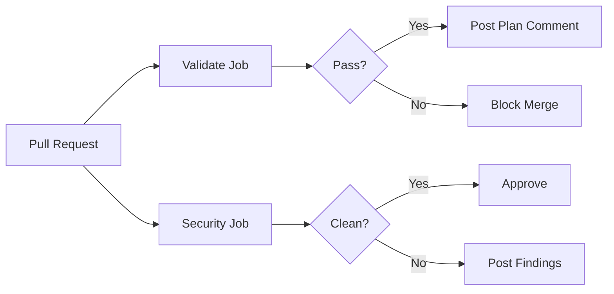

# GitHub Actions Pipeline

This tutorial shows you how to use Terry-Form MCP in GitHub Actions to automatically validate Terraform configurations, run security scans, and post plan output as PR comments.

## What You'll Learn

- How to run Terry-Form MCP in a CI pipeline
- How to validate Terraform on every pull request
- How to scan for security issues on push to main
- How to post plan output as a PR comment

## Pipeline Architecture



## Step 1: Repository Structure

Set up your repository:

```
my-infrastructure/
├── .github/
│   └── workflows/
│       └── terraform-ci.yaml
├── Dockerfile              # or reference to terry-form-mcp image
├── terraform/
│   ├── main.tf
│   ├── variables.tf
│   └── outputs.tf
└── README.md
```

## Step 2: Basic Validation Workflow

Create `.github/workflows/terraform-ci.yaml`:

```yaml
name: Terraform CI

on:
  pull_request:
    paths:
      - 'terraform/**'

jobs:
  validate:
    name: Validate Terraform
    runs-on: ubuntu-latest

    steps:
      - name: Checkout code
        uses: actions/checkout@v4

      - name: Build Terry-Form MCP
        run: |
          docker build -t terry-form-mcp \
            https://github.com/aj-geddes/terry-form-mcp.git

      - name: Initialize and Validate
        id: validate
        run: |
          RESULT=$(echo '{"jsonrpc":"2.0","method":"tools/call","params":{"name":"terry","arguments":{"path":".","actions":["init","validate"]}}}' | \
            docker run -i --rm \
              -v ${{ github.workspace }}/terraform:/mnt/workspace/project \
              terry-form-mcp:latest)
          echo "result<<EOF" >> $GITHUB_OUTPUT
          echo "$RESULT" >> $GITHUB_OUTPUT
          echo "EOF" >> $GITHUB_OUTPUT

      - name: Check validation result
        run: |
          echo '${{ steps.validate.outputs.result }}' | \
            python3 -c "
          import sys, json
          data = json.load(sys.stdin)
          # Check for validation success in the response
          print(json.dumps(data, indent=2))
          "
```

## Step 3: Add Plan Output as PR Comment

Extend the workflow to generate a plan and post it as a comment:

```yaml
  plan:
    name: Terraform Plan
    runs-on: ubuntu-latest
    if: github.event_name == 'pull_request'

    steps:
      - name: Checkout code
        uses: actions/checkout@v4

      - name: Build Terry-Form MCP
        run: |
          docker build -t terry-form-mcp \
            https://github.com/aj-geddes/terry-form-mcp.git

      - name: Run Terraform Plan
        id: plan
        run: |
          RESULT=$(echo '{"jsonrpc":"2.0","method":"tools/call","params":{"name":"terry","arguments":{"path":".","actions":["init","plan"]}}}' | \
            docker run -i --rm \
              -v ${{ github.workspace }}/terraform:/mnt/workspace/project \
              -e AWS_ACCESS_KEY_ID=${{ secrets.AWS_ACCESS_KEY_ID }} \
              -e AWS_SECRET_ACCESS_KEY=${{ secrets.AWS_SECRET_ACCESS_KEY }} \
              -e AWS_DEFAULT_REGION=${{ secrets.AWS_DEFAULT_REGION }} \
              terry-form-mcp:latest)
          echo "result<<EOF" >> $GITHUB_OUTPUT
          echo "$RESULT" >> $GITHUB_OUTPUT
          echo "EOF" >> $GITHUB_OUTPUT

      - name: Comment Plan on PR
        uses: actions/github-script@v7
        if: github.event_name == 'pull_request'
        with:
          script: |
            const plan = `${{ steps.plan.outputs.result }}`;
            const body = `## Terraform Plan

            \`\`\`json
            ${plan.substring(0, 60000)}
            \`\`\`

            *Generated by Terry-Form MCP*`;

            // Find existing comment
            const { data: comments } = await github.rest.issues.listComments({
              issue_number: context.issue.number,
              owner: context.repo.owner,
              repo: context.repo.repo,
            });
            const existing = comments.find(c =>
              c.body.includes('## Terraform Plan') &&
              c.body.includes('Terry-Form MCP')
            );

            if (existing) {
              await github.rest.issues.updateComment({
                owner: context.repo.owner,
                repo: context.repo.repo,
                comment_id: existing.id,
                body: body
              });
            } else {
              await github.rest.issues.createComment({
                issue_number: context.issue.number,
                owner: context.repo.owner,
                repo: context.repo.repo,
                body: body
              });
            }
```

## Step 4: Add Security Scanning

Add a security scan job that runs on push to main:

```yaml
  security:
    name: Security Scan
    runs-on: ubuntu-latest

    steps:
      - name: Checkout code
        uses: actions/checkout@v4

      - name: Build Terry-Form MCP
        run: |
          docker build -t terry-form-mcp \
            https://github.com/aj-geddes/terry-form-mcp.git

      - name: Run Security Scan
        id: security
        run: |
          RESULT=$(echo '{"jsonrpc":"2.0","method":"tools/call","params":{"name":"terry_security_scan","arguments":{"path":".","severity":"medium"}}}' | \
            docker run -i --rm \
              -v ${{ github.workspace }}/terraform:/mnt/workspace/project \
              terry-form-mcp:latest)
          echo "result<<EOF" >> $GITHUB_OUTPUT
          echo "$RESULT" >> $GITHUB_OUTPUT
          echo "EOF" >> $GITHUB_OUTPUT

      - name: Check for findings
        run: |
          echo '${{ steps.security.outputs.result }}' | \
            python3 -c "
          import sys, json
          data = json.load(sys.stdin)
          print(json.dumps(data, indent=2))
          # Fail if high severity findings exist
          "

      - name: Run Best Practice Analysis
        id: analyze
        run: |
          RESULT=$(echo '{"jsonrpc":"2.0","method":"tools/call","params":{"name":"terry_analyze","arguments":{"path":"."}}}' | \
            docker run -i --rm \
              -v ${{ github.workspace }}/terraform:/mnt/workspace/project \
              terry-form-mcp:latest)
          echo "result<<EOF" >> $GITHUB_OUTPUT
          echo "$RESULT" >> $GITHUB_OUTPUT
          echo "EOF" >> $GITHUB_OUTPUT
```

## Step 5: Complete Workflow

Here's the complete workflow combining all three jobs:

```yaml
name: Terraform CI

on:
  pull_request:
    paths:
      - 'terraform/**'
  push:
    branches: [main]
    paths:
      - 'terraform/**'

jobs:
  validate:
    name: Validate
    runs-on: ubuntu-latest
    steps:
      - uses: actions/checkout@v4

      - name: Build Terry-Form MCP
        run: docker build -t terry-form-mcp https://github.com/aj-geddes/terry-form-mcp.git

      - name: Validate
        run: |
          echo '{"jsonrpc":"2.0","method":"tools/call","params":{"name":"terry","arguments":{"path":".","actions":["init","fmt","validate"]}}}' | \
            docker run -i --rm \
              -v ${{ github.workspace }}/terraform:/mnt/workspace/project \
              terry-form-mcp:latest

  security:
    name: Security Scan
    runs-on: ubuntu-latest
    steps:
      - uses: actions/checkout@v4

      - name: Build Terry-Form MCP
        run: docker build -t terry-form-mcp https://github.com/aj-geddes/terry-form-mcp.git

      - name: Scan
        run: |
          echo '{"jsonrpc":"2.0","method":"tools/call","params":{"name":"terry_security_scan","arguments":{"path":".","severity":"medium"}}}' | \
            docker run -i --rm \
              -v ${{ github.workspace }}/terraform:/mnt/workspace/project \
              terry-form-mcp:latest

  plan:
    name: Plan
    runs-on: ubuntu-latest
    needs: [validate, security]
    if: github.event_name == 'pull_request'
    steps:
      - uses: actions/checkout@v4

      - name: Build Terry-Form MCP
        run: docker build -t terry-form-mcp https://github.com/aj-geddes/terry-form-mcp.git

      - name: Plan
        id: plan
        run: |
          RESULT=$(echo '{"jsonrpc":"2.0","method":"tools/call","params":{"name":"terry","arguments":{"path":".","actions":["init","plan"]}}}' | \
            docker run -i --rm \
              -v ${{ github.workspace }}/terraform:/mnt/workspace/project \
              -e AWS_ACCESS_KEY_ID=${{ secrets.AWS_ACCESS_KEY_ID }} \
              -e AWS_SECRET_ACCESS_KEY=${{ secrets.AWS_SECRET_ACCESS_KEY }} \
              -e AWS_DEFAULT_REGION=${{ secrets.AWS_DEFAULT_REGION }} \
              terry-form-mcp:latest)
          echo "result<<EOF" >> $GITHUB_OUTPUT
          echo "$RESULT" >> $GITHUB_OUTPUT
          echo "EOF" >> $GITHUB_OUTPUT

      - name: Comment on PR
        uses: actions/github-script@v7
        with:
          script: |
            const plan = `${{ steps.plan.outputs.result }}`;
            await github.rest.issues.createComment({
              issue_number: context.issue.number,
              owner: context.repo.owner,
              repo: context.repo.repo,
              body: `## Terraform Plan\n\`\`\`json\n${plan.substring(0, 60000)}\n\`\`\`\n\n*Generated by Terry-Form MCP*`
            });
```

## Step 6: Credential Management

### Using OIDC (Recommended)

For AWS, use OIDC instead of static credentials:

```yaml
      - name: Configure AWS Credentials
        uses: aws-actions/configure-aws-credentials@v4
        with:
          role-to-assume: arn:aws:iam::123456789012:role/terraform-ci
          aws-region: us-east-1

      - name: Plan with OIDC
        run: |
          echo '...' | \
            docker run -i --rm \
              -v ${{ github.workspace }}/terraform:/mnt/workspace/project \
              -e AWS_ACCESS_KEY_ID \
              -e AWS_SECRET_ACCESS_KEY \
              -e AWS_SESSION_TOKEN \
              -e AWS_DEFAULT_REGION \
              terry-form-mcp:latest
```

### Using GitHub Secrets

Store credentials as repository secrets:

1. Go to **Settings > Secrets and variables > Actions**
2. Add: `AWS_ACCESS_KEY_ID`, `AWS_SECRET_ACCESS_KEY`, `AWS_DEFAULT_REGION`
3. Reference as `${{ secrets.SECRET_NAME }}`



## Step 7: Parse Results

Check results programmatically in your workflow:

```bash
RESULT=$(echo '...' | docker run -i --rm ... terry-form-mcp:latest)

# Extract success status
SUCCESS=$(echo "$RESULT" | jq -r '.[\"terry-results\"][-1].success')

if [ "$SUCCESS" != "true" ]; then
  echo "::error::Terraform validation failed"
  exit 1
fi
```

## Pipeline Patterns

### Gate Pattern
Validation and security must pass before plan runs:

```yaml
plan:
  needs: [validate, security]
```

### Matrix Pattern
Validate multiple environments:

```yaml
strategy:
  matrix:
    environment: [dev, staging, prod]
steps:
  - run: |
      echo '{"jsonrpc":"2.0","method":"tools/call","params":{"name":"terry","arguments":{"path":"environments/${{ matrix.environment }}","actions":["init","validate"]}}}' | ...
```



## Summary

In this tutorial, you learned how to:

- Run Terry-Form MCP in GitHub Actions
- Validate Terraform configurations automatically on PRs
- Run security scans on push to main
- Post plan output as PR comments
- Manage credentials securely with OIDC or GitHub secrets
- Parse JSON results to gate pipeline stages

## Next Steps

- [Multi-Environment Setup]({{ site.baseurl }}/tutorials/multi-environment/) — Manage dev/staging/prod with shared modules
- [CI/CD Integration Guide]({{ site.baseurl }}/guides/ci-cd-integration/) — More CI patterns including GitLab CI
- [Security Guide]({{ site.baseurl }}/guides/security/) — Comprehensive security reference

---

<div class="tutorial-nav">
  <a href="{{ site.baseurl }}/tutorials/module-development/" class="btn">← Module Development</a>
  <a href="{{ site.baseurl }}/tutorials/multi-environment/" class="btn btn-primary">Next: Multi-Environment →</a>
</div>
