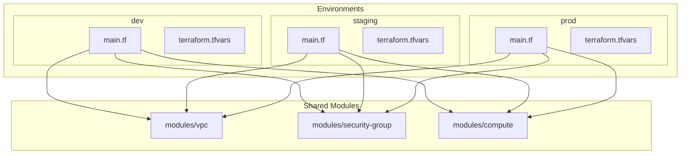

# Multi-Environment Setup

This tutorial shows you how to structure a multi-environment Terraform project with shared modules, environment-specific configurations, and cross-environment validation using Terry-Form MCP.

## What You'll Learn

- How to structure a multi-environment project
- How to share modules across environments
- How to use per-environment variable files
- How to validate and plan all environments
- How to compare plans across environments

## Architecture



## Step 1: Project Structure

Create the workspace layout:

```
workspace/
└── multi-env/
    ├── modules/
    │   ├── vpc/
    │   │   ├── main.tf
    │   │   ├── variables.tf
    │   │   └── outputs.tf
    │   ├── security-group/
    │   │   ├── main.tf
    │   │   ├── variables.tf
    │   │   └── outputs.tf
    │   └── compute/
    │       ├── main.tf
    │       ├── variables.tf
    │       └── outputs.tf
    └── environments/
        ├── dev/
        │   ├── main.tf
        │   ├── variables.tf
        │   ├── outputs.tf
        │   └── terraform.tfvars
        ├── staging/
        │   ├── main.tf
        │   ├── variables.tf
        │   ├── outputs.tf
        │   └── terraform.tfvars
        └── prod/
            ├── main.tf
            ├── variables.tf
            ├── outputs.tf
            └── terraform.tfvars
```

## Step 2: Create the VPC Module

If you completed the [Module Development]({{ site.baseurl }}/tutorials/module-development/) tutorial, you already have a VPC module. Otherwise, create one:

**modules/vpc/variables.tf:**
```hcl
variable "name" {
  description = "Name prefix for VPC resources"
  type        = string
}

variable "cidr_block" {
  description = "CIDR block for the VPC"
  type        = string
}

variable "availability_zones" {
  description = "List of availability zones"
  type        = list(string)
}

variable "public_subnet_cidrs" {
  description = "CIDR blocks for public subnets"
  type        = list(string)
}

variable "private_subnet_cidrs" {
  description = "CIDR blocks for private subnets"
  type        = list(string)
}

variable "enable_nat_gateway" {
  description = "Whether to create a NAT gateway"
  type        = bool
  default     = false
}

variable "tags" {
  description = "Additional tags for all resources"
  type        = map(string)
  default     = {}
}
```

**modules/vpc/main.tf:**
```hcl
resource "aws_vpc" "this" {
  cidr_block           = var.cidr_block
  enable_dns_hostnames = true
  enable_dns_support   = true

  tags = merge(var.tags, {
    Name = "${var.name}-vpc"
  })
}

resource "aws_internet_gateway" "this" {
  vpc_id = aws_vpc.this.id

  tags = merge(var.tags, {
    Name = "${var.name}-igw"
  })
}

resource "aws_subnet" "public" {
  count = length(var.public_subnet_cidrs)

  vpc_id                  = aws_vpc.this.id
  cidr_block              = var.public_subnet_cidrs[count.index]
  availability_zone       = var.availability_zones[count.index]
  map_public_ip_on_launch = true

  tags = merge(var.tags, {
    Name = "${var.name}-public-${count.index + 1}"
  })
}

resource "aws_subnet" "private" {
  count = length(var.private_subnet_cidrs)

  vpc_id            = aws_vpc.this.id
  cidr_block        = var.private_subnet_cidrs[count.index]
  availability_zone = var.availability_zones[count.index]

  tags = merge(var.tags, {
    Name = "${var.name}-private-${count.index + 1}"
  })
}
```

**modules/vpc/outputs.tf:**
```hcl
output "vpc_id" {
  description = "ID of the VPC"
  value       = aws_vpc.this.id
}

output "public_subnet_ids" {
  description = "IDs of public subnets"
  value       = aws_subnet.public[*].id
}

output "private_subnet_ids" {
  description = "IDs of private subnets"
  value       = aws_subnet.private[*].id
}
```

## Step 3: Create the Security Group Module

**modules/security-group/variables.tf:**
```hcl
variable "name" {
  description = "Name prefix for security groups"
  type        = string
}

variable "vpc_id" {
  description = "VPC ID where security groups are created"
  type        = string
}

variable "allowed_ssh_cidrs" {
  description = "CIDR blocks allowed SSH access"
  type        = list(string)
  default     = []
}

variable "tags" {
  description = "Additional tags"
  type        = map(string)
  default     = {}
}
```

**modules/security-group/main.tf:**
```hcl
resource "aws_security_group" "web" {
  name_prefix = "${var.name}-web-"
  description = "Web server security group"
  vpc_id      = var.vpc_id

  ingress {
    from_port   = 443
    to_port     = 443
    protocol    = "tcp"
    cidr_blocks = ["0.0.0.0/0"]
    description = "HTTPS"
  }

  ingress {
    from_port   = 80
    to_port     = 80
    protocol    = "tcp"
    cidr_blocks = ["0.0.0.0/0"]
    description = "HTTP"
  }

  dynamic "ingress" {
    for_each = length(var.allowed_ssh_cidrs) > 0 ? [1] : []
    content {
      from_port   = 22
      to_port     = 22
      protocol    = "tcp"
      cidr_blocks = var.allowed_ssh_cidrs
      description = "SSH from allowed ranges"
    }
  }

  egress {
    from_port   = 0
    to_port     = 0
    protocol    = "-1"
    cidr_blocks = ["0.0.0.0/0"]
    description = "Allow all outbound"
  }

  tags = merge(var.tags, {
    Name = "${var.name}-web-sg"
  })
}
```

**modules/security-group/outputs.tf:**
```hcl
output "web_security_group_id" {
  description = "ID of the web security group"
  value       = aws_security_group.web.id
}
```

## Step 4: Create the Compute Module

**modules/compute/variables.tf:**
```hcl
variable "name" {
  description = "Name prefix for compute resources"
  type        = string
}

variable "instance_type" {
  description = "EC2 instance type"
  type        = string
  default     = "t3.micro"
}

variable "instance_count" {
  description = "Number of instances to create"
  type        = number
  default     = 1
}

variable "subnet_ids" {
  description = "Subnet IDs for instances"
  type        = list(string)
}

variable "security_group_ids" {
  description = "Security group IDs"
  type        = list(string)
}

variable "tags" {
  description = "Additional tags"
  type        = map(string)
  default     = {}
}
```

**modules/compute/main.tf:**
```hcl
data "aws_ami" "amazon_linux" {
  most_recent = true
  owners      = ["amazon"]

  filter {
    name   = "name"
    values = ["al2023-ami-*-x86_64"]
  }
}

resource "aws_instance" "this" {
  count = var.instance_count

  ami           = data.aws_ami.amazon_linux.id
  instance_type = var.instance_type
  subnet_id     = var.subnet_ids[count.index % length(var.subnet_ids)]

  vpc_security_group_ids = var.security_group_ids

  tags = merge(var.tags, {
    Name = "${var.name}-${count.index + 1}"
  })
}
```

**modules/compute/outputs.tf:**
```hcl
output "instance_ids" {
  description = "IDs of created instances"
  value       = aws_instance.this[*].id
}

output "private_ips" {
  description = "Private IP addresses of instances"
  value       = aws_instance.this[*].private_ip
}
```

## Step 5: Create Environment Configurations

Each environment uses the same modules but with different parameters.

### Shared Variables

All environments share the same `variables.tf`:

**environments/\*/variables.tf:**
```hcl
variable "aws_region" {
  description = "AWS region"
  type        = string
  default     = "us-east-1"
}

variable "environment" {
  description = "Environment name"
  type        = string
}

variable "project_name" {
  description = "Project name for resource tagging"
  type        = string
  default     = "multi-env-tutorial"
}
```

### Shared Main Configuration

**environments/\*/main.tf:**
```hcl
terraform {
  required_version = ">= 1.0"

  required_providers {
    aws = {
      source  = "hashicorp/aws"
      version = "~> 5.0"
    }
  }
}

locals {
  name = "${var.project_name}-${var.environment}"

  env_config = {
    dev = {
      vpc_cidr             = "10.0.0.0/16"
      azs                  = ["us-east-1a", "us-east-1b"]
      public_subnet_cidrs  = ["10.0.1.0/24", "10.0.2.0/24"]
      private_subnet_cidrs = ["10.0.10.0/24", "10.0.11.0/24"]
      enable_nat           = false
      instance_type        = "t3.micro"
      instance_count       = 1
      allowed_ssh_cidrs    = ["10.0.0.0/8"]
    }
    staging = {
      vpc_cidr             = "10.1.0.0/16"
      azs                  = ["us-east-1a", "us-east-1b"]
      public_subnet_cidrs  = ["10.1.1.0/24", "10.1.2.0/24"]
      private_subnet_cidrs = ["10.1.10.0/24", "10.1.11.0/24"]
      enable_nat           = true
      instance_type        = "t3.small"
      instance_count       = 2
      allowed_ssh_cidrs    = ["10.0.0.0/8"]
    }
    prod = {
      vpc_cidr             = "10.2.0.0/16"
      azs                  = ["us-east-1a", "us-east-1b", "us-east-1c"]
      public_subnet_cidrs  = ["10.2.1.0/24", "10.2.2.0/24", "10.2.3.0/24"]
      private_subnet_cidrs = ["10.2.10.0/24", "10.2.11.0/24", "10.2.12.0/24"]
      enable_nat           = true
      instance_type        = "t3.medium"
      instance_count       = 3
      allowed_ssh_cidrs    = []
    }
  }

  config = local.env_config[var.environment]
}

provider "aws" {
  region = var.aws_region

  default_tags {
    tags = {
      Project     = var.project_name
      Environment = var.environment
      ManagedBy   = "Terraform"
    }
  }
}

module "vpc" {
  source = "../../modules/vpc"

  name                 = local.name
  cidr_block           = local.config.vpc_cidr
  availability_zones   = local.config.azs
  public_subnet_cidrs  = local.config.public_subnet_cidrs
  private_subnet_cidrs = local.config.private_subnet_cidrs
  enable_nat_gateway   = local.config.enable_nat

  tags = {
    Environment = var.environment
  }
}

module "security" {
  source = "../../modules/security-group"

  name              = local.name
  vpc_id            = module.vpc.vpc_id
  allowed_ssh_cidrs = local.config.allowed_ssh_cidrs

  tags = {
    Environment = var.environment
  }
}

module "compute" {
  source = "../../modules/compute"

  name               = local.name
  instance_type      = local.config.instance_type
  instance_count     = local.config.instance_count
  subnet_ids         = module.vpc.private_subnet_ids
  security_group_ids = [module.security.web_security_group_id]

  tags = {
    Environment = var.environment
  }
}
```

### Per-Environment tfvars

**environments/dev/terraform.tfvars:**
```hcl
environment = "dev"
```

**environments/staging/terraform.tfvars:**
```hcl
environment = "staging"
```

**environments/prod/terraform.tfvars:**
```hcl
environment = "prod"
```

### Shared Outputs

**environments/\*/outputs.tf:**
```hcl
output "vpc_id" {
  description = "VPC ID"
  value       = module.vpc.vpc_id
}

output "instance_count" {
  description = "Number of instances"
  value       = length(module.compute.instance_ids)
}

output "instance_private_ips" {
  description = "Private IPs of instances"
  value       = module.compute.private_ips
}
```

## Step 6: Validate All Environments

Use Terry-Form MCP to validate each environment. Ask your AI assistant:

> "Initialize and validate all three environments: dev, staging, and prod under multi-env/environments/"

The assistant will run for each environment:

```json
{
  "tool": "terry",
  "arguments": {
    "path": "multi-env/environments/dev",
    "actions": ["init", "validate"],
    "vars": {"environment": "dev"}
  }
}
```

```json
{
  "tool": "terry",
  "arguments": {
    "path": "multi-env/environments/staging",
    "actions": ["init", "validate"],
    "vars": {"environment": "staging"}
  }
}
```

```json
{
  "tool": "terry",
  "arguments": {
    "path": "multi-env/environments/prod",
    "actions": ["init", "validate"],
    "vars": {"environment": "prod"}
  }
}
```

## Step 7: Compare Plans Across Environments

Generate plans for each environment to compare:

> "Generate Terraform plans for dev, staging, and prod and summarize the differences"

The assistant calls `terry` with `["init", "plan"]` for each environment.

### Expected Differences

| Resource | Dev | Staging | Prod |
|----------|-----|---------|------|
| AZs | 2 | 2 | 3 |
| NAT Gateway | No | Yes | Yes |
| Instance type | t3.micro | t3.small | t3.medium |
| Instance count | 1 | 2 | 3 |
| SSH access | Internal only | Internal only | None |

## Step 8: Security Scan All Environments

Run security scans across all environments:

> "Run security scans on all three environments"

```json
{
  "tool": "terry_security_scan",
  "arguments": {
    "path": "multi-env/environments/dev",
    "severity": "medium"
  }
}
```

Repeat for staging and prod. Compare findings — production should have stricter security (no SSH access, NAT gateway for private subnet internet access).

## Step 9: Analyze Shared Modules

Also analyze the shared modules for best practices:

> "Analyze the VPC, security-group, and compute modules for best practices"

```json
{
  "tool": "terry_analyze",
  "arguments": {
    "path": "multi-env/modules/vpc"
  }
}
```

Well-structured modules should pass with minimal warnings.

## Step 10: Workspace Discovery

Use Terry-Form's workspace tools to explore the structure:

> "List all workspaces and show info about the multi-env project"

```json
{
  "tool": "terry_workspace_list",
  "arguments": {}
}
```

```json
{
  "tool": "terry_workspace_info",
  "arguments": {
    "path": "multi-env/environments/prod"
  }
}
```

## Multi-Environment Patterns

### Pattern 1: Environment Map (Used Above)
Define all environment configs in a `locals` map. Simple, everything in one file.

### Pattern 2: Separate tfvars Files
Same `main.tf` everywhere, different `terraform.tfvars` per environment. Better for large configs.

### Pattern 3: Terragrunt
Use Terragrunt for DRY configuration across environments. Terry-Form MCP works with the generated Terraform files.

## Summary

In this tutorial, you learned how to:

- Structure a multi-environment project with shared modules
- Use a locals map for environment-specific configuration
- Validate and plan all environments with Terry-Form MCP
- Compare plans across dev, staging, and production
- Run cross-environment security scans
- Analyze shared modules for best practices

## Next Steps

- [CI/CD Integration Guide]({{ site.baseurl }}/guides/ci-cd-integration/) — Automate multi-environment validation
- [Best Practices Guide]({{ site.baseurl }}/guides/best-practices/) — Workspace organization tips
- [Terraform Operations Guide]({{ site.baseurl }}/guides/terraform-operations/) — Deep dive into the terry tool

---

<div class="tutorial-nav">
  <a href="{{ site.baseurl }}/tutorials/github-actions-pipeline/" class="btn">← GitHub Actions Pipeline</a>
  <a href="{{ site.baseurl }}/tutorials/" class="btn btn-primary">Back to Tutorials</a>
</div>
