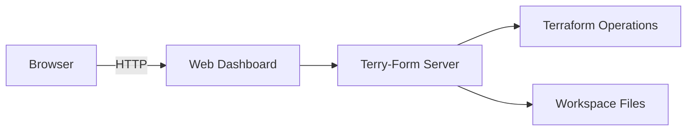

# Getting Started with Terry-Form MCP

Welcome to Terry-Form MCP! This guide will help you get up and running quickly.

## Prerequisites

Before you begin, ensure you have the following installed:

- **Docker** (recommended) or Python 3.9+
- **Terraform** (if running locally)
- An AI assistant that supports MCP (Claude, etc.)
- A workspace directory for your Terraform configurations

## Installation Options

### Option 1: Docker (Recommended)

Docker provides the easiest and most secure way to run Terry-Form MCP.

```bash
# Clone the repository
git clone https://github.com/aj-geddes/terry-form-mcp.git
cd terry-form-mcp

# Build the image
./build.sh

# Run the server (MCP uses stdio, not HTTP)
docker run -it --rm \
  -v "$(pwd)":/mnt/workspace \
  terry-form-mcp:latest
```

**Note**: This server uses stdio transport for MCP protocol, not HTTP. It should be invoked by your MCP client (e.g., Claude Desktop), not run as a daemon.

### Option 2: Local Development

For development or testing:

```bash
# Clone the repository
git clone https://github.com/aj-geddes/terry-form-mcp.git
cd terry-form-mcp

# Install dependencies
pip install -r requirements.txt

# Run the server directly
python3 server_enhanced_with_lsp.py
```

## Configuration

### 1. AI Assistant Configuration

Configure your AI assistant to use Terry-Form MCP. For Claude Desktop, edit your `claude_desktop_config.json`:

```json
{
  "mcpServers": {
    "terry-form": {
      "command": "docker",
      "args": [
        "run",
        "-i",
        "--rm",
        "-v",
        "/path/to/workspace:/mnt/workspace",
        "terry-form-mcp:latest"
      ]
    }
  }
}
```

### 2. Environment Variables

Key environment variables:

| Variable | Description | Required |
|----------|-------------|----------|
| `WORKSPACE_ROOT` | Root directory for Terraform files | Yes |
| `TERRAFORM_CLOUD_TOKEN` | Terraform Cloud API token | No |
| `GITHUB_APP_ID` | GitHub App ID for repo integration | No |
| `GITHUB_APP_PRIVATE_KEY` | GitHub App private key | No |
| `LOG_LEVEL` | Logging level (INFO, DEBUG) | No |

### 3. Security Configuration

Terry-Form MCP includes several security features by default:

```yaml
# Security settings (built-in)
security:
  allowed_actions:
    - init
    - validate
    - plan
    - fmt
  blocked_actions:
    - apply
    - destroy
  path_validation: strict
  input_sanitization: enabled
```

## Your First Terraform Operation

### 1. Create a Simple Configuration

Create a file `workspace/main.tf`:

```hcl
terraform {
  required_version = ">= 1.0"
}

variable "project_name" {
  description = "Name of the project"
  type        = string
  default     = "my-first-project"
}

output "project_info" {
  value = "Project: ${var.project_name}"
}
```

### 2. Use Terry-Form with Your AI Assistant

Ask your AI assistant:

```
Can you help me validate and plan my Terraform configuration in the workspace directory?
```

The assistant will use Terry-Form MCP to:
1. Initialize the Terraform workspace
2. Validate the configuration
3. Generate an execution plan
4. Provide feedback and recommendations

### 3. Example Response

```json
{
  "terry-results": [
    {
      "action": "init",
      "success": true,
      "stdout": "Terraform has been successfully initialized!"
    },
    {
      "action": "validate",
      "success": true,
      "stdout": "Success! The configuration is valid."
    },
    {
      "action": "plan",
      "success": true,
      "plan_summary": {
        "add": 0,
        "change": 0,
        "destroy": 0
      }
    }
  ]
}
```

## Common Use Cases

### Managing Multiple Environments

```bash
# Development environment
terry path: "environments/dev" actions: ["plan"] vars: {"env": "development"}

# Production environment  
terry path: "environments/prod" actions: ["plan"] vars: {"env": "production"}
```

### Working with Modules

```hcl
# workspace/modules/vpc/main.tf
module "vpc" {
  source = "./modules/vpc"
  
  cidr_block = var.vpc_cidr
  environment = var.environment
}
```

### GitHub Integration

If you've configured GitHub App integration:

```bash
# Clone and analyze a repository
github_clone_repo owner: "myorg" repo: "infrastructure"

# List Terraform files
github_list_terraform_files owner: "myorg" repo: "infrastructure"
```

## Web Dashboard

Access the web dashboard at `http://localhost:3000` to:

- Monitor Terraform operations in real-time
- View workspace status
- Check system health
- Review operation history



## Troubleshooting

### Common Issues

<div class="alert alert-info">
<strong>Permission Denied</strong><br>
Ensure the workspace directory has proper permissions:
<code>chmod -R 755 /path/to/workspace</code>
</div>

<div class="alert alert-warning">
<strong>Terraform Not Found</strong><br>
If using Docker, Terraform is included. For local setup:
<code>brew install terraform</code> or <code>apt-get install terraform</code>
</div>

<div class="alert alert-danger">
<strong>MCP Connection Failed</strong><br>
Check that Docker is running and the container started successfully:
<code>docker logs terry-form</code>
</div>

### Debug Mode

Enable debug logging for troubleshooting:

```bash
docker run -d \
  -e LOG_LEVEL=DEBUG \
  -v /path/to/workspace:/mnt/workspace \
  aj-geddes/terry-form-mcp:latest
```

## Best Practices

1. **Use Version Control**: Always version control your Terraform configurations
2. **Plan Before Apply**: Review plans carefully before applying changes
3. **Use Workspaces**: Separate environments using Terraform workspaces
4. **Secure Secrets**: Use environment variables or secret management tools
5. **Regular Backups**: Backup your state files regularly

## Next Steps

Now that you have Terry-Form MCP running:

- 📖 Read the [Architecture Overview]({{ site.baseurl }}/architecture/)
- 🔒 Review the [Security Guide]({{ site.baseurl }}/guides/security)
- 📚 Explore [Available Tutorials]({{ site.baseurl }}/tutorials/)

## Getting Help

- 💬 [GitHub Discussions](https://github.com/aj-geddes/terry-form-mcp/discussions)
- 🐛 [Report Issues](https://github.com/aj-geddes/terry-form-mcp/issues)
- 📧 [Email Support](mailto:support@terry-form.io)

---

<div class="alert alert-success">
<strong>🎉 Congratulations!</strong><br>
You've successfully set up Terry-Form MCP. Start exploring its features and automate your infrastructure with confidence!
</div>