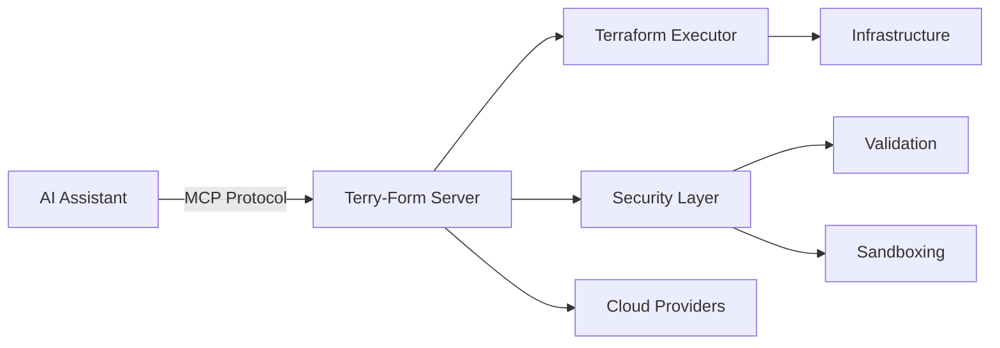
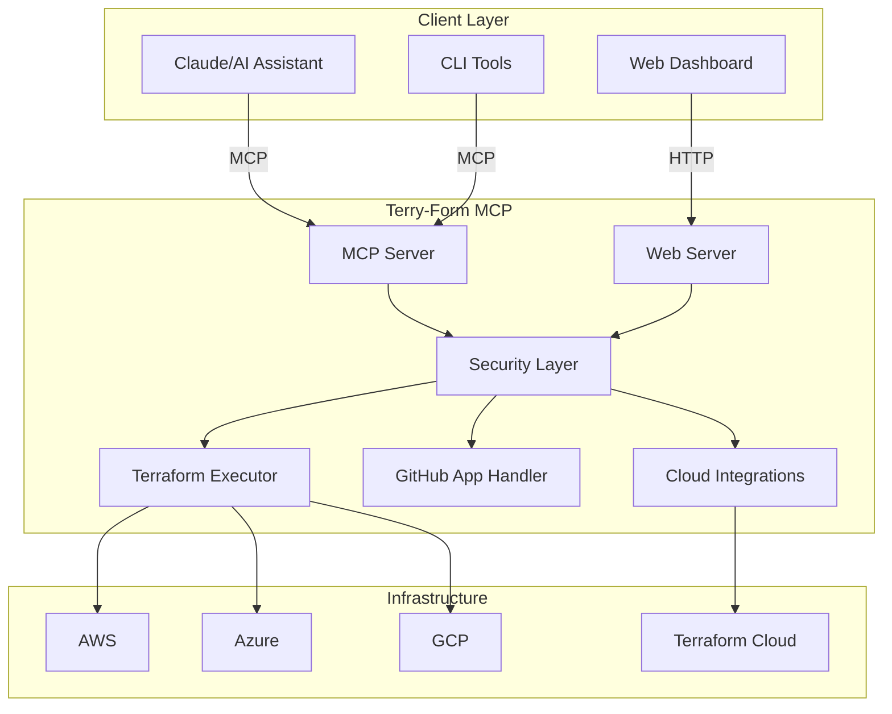

<div class="hero-section">
  <h1 class="hero-title">Terry-Form MCP</h1>
  <p class="hero-subtitle">Enterprise-grade Terraform automation through Model Context Protocol</p>
  <div class="hero-buttons">
    <a href="{{ site.baseurl }}/getting-started" class="btn btn-primary">Get Started</a>
    <a href="{{ site.baseurl }}/guides/" class="btn btn-secondary">View Guides</a>
    <a href="https://github.com/aj-geddes/terry-form-mcp" class="btn btn-github" target="_blank" rel="noopener noreferrer">
      <i class="fab fa-github"></i> GitHub
    </a>
  </div>
</div>

<div class="features-grid">
  <div class="feature-card">
    <div class="feature-icon">
      <i class="fas fa-shield-alt"></i>
    </div>
    <h3>Security First</h3>
    <p>Enterprise-hardened with comprehensive security controls, input validation, and sandboxed execution</p>
  </div>

  <div class="feature-card">
    <div class="feature-icon">
      <i class="fas fa-robot"></i>
    </div>
    <h3>AI-Powered</h3>
    <p>Intelligent automation with MCP protocol integration for seamless AI assistant workflows</p>
  </div>

  <div class="feature-card">
    <div class="feature-icon">
      <i class="fas fa-cloud"></i>
    </div>
    <h3>Multi-Cloud</h3>
    <p>Support for AWS, Azure, GCP, and Terraform Cloud with unified management interface</p>
  </div>

  <div class="feature-card">
    <div class="feature-icon">
      <i class="fas fa-code"></i>
    </div>
    <h3>Developer Friendly</h3>
    <p>LSP integration, GitHub App support, and comprehensive API for modern DevOps workflows</p>
  </div>

  <div class="feature-card">
    <div class="feature-icon">
      <i class="fas fa-search"></i>
    </div>
    <h3>Code Intelligence</h3>
    <p>LSP-powered validation, security scanning, and best practice recommendations</p>
  </div>

  <div class="feature-card">
    <div class="feature-icon">
      <i class="fas fa-rocket"></i>
    </div>
    <h3>Production Ready</h3>
    <p>Docker containerization with comprehensive security controls and rate limiting</p>
  </div>
</div>

## What is Terry-Form MCP?

Terry-Form MCP is a secure, production-ready Terraform automation server that integrates with AI assistants through the Model Context Protocol (MCP). It provides a controlled environment for infrastructure-as-code operations with comprehensive LSP integration for intelligent development.



## Key Features

### Security Hardened

- **Input Validation**: Comprehensive request validation and sanitization
- **Path Traversal Protection**: Secure file system access controls
- **Command Injection Prevention**: Safe subprocess execution
- **Sandboxed Execution**: Isolated Terraform operations

### MCP Protocol Integration

- **Native MCP Support**: Built for AI assistant integration
- **Tool Discovery**: Automatic tool registration and documentation
- **Streaming Responses**: Real-time operation feedback
- **Error Handling**: Graceful error reporting and recovery

### Infrastructure Management

- **Multi-Workspace**: Manage multiple Terraform workspaces
- **State Management**: Secure state file handling
- **Plan Analysis**: Terraform plan execution and validation
- **LSP Integration**: terraform-ls for code intelligence

### Integrations

- **GitHub App**: Optional repository integration via GitHub OAuth
- **Terraform Cloud**: Basic workspace and run monitoring
- **LSP Support**: Full Language Server Protocol integration via terraform-ls
- **MCP Protocol**: Native Model Context Protocol for AI assistants

## Quick Start

```bash
# Using Docker
docker run -d \
  -p 3000:3000 \
  -v /path/to/workspace:/mnt/workspace \
  aj-geddes/terry-form-mcp:latest

# Using Docker Compose
docker-compose up -d

# Configure your AI assistant
{
  "mcpServers": {
    "terry-form": {
      "command": "docker",
      "args": ["run", "-i", "--rm", "-v", "./workspace:/mnt/workspace", "terry-form-mcp"]
    }
  }
}
```

## Use Cases

<div class="use-cases">
  <div class="use-case">
    <h3><i class="fas fa-building"></i> Enterprise Infrastructure</h3>
    <p>Manage complex multi-cloud environments with security controls and compliance</p>
  </div>

  <div class="use-case">
    <h3><i class="fas fa-sync-alt"></i> CI/CD Integration</h3>
    <p>Automate infrastructure provisioning in your deployment pipelines</p>
  </div>

  <div class="use-case">
    <h3><i class="fas fa-users"></i> Team Collaboration</h3>
    <p>Enable safe infrastructure changes through AI-assisted workflows</p>
  </div>

  <div class="use-case">
    <h3><i class="fas fa-graduation-cap"></i> Learning Platform</h3>
    <p>Safe environment for learning and experimenting with Terraform</p>
  </div>
</div>

## Architecture Overview



## Getting Help

<div class="help-section">
  <div class="help-card">
    <h3><i class="fas fa-book"></i> Documentation</h3>
    <p>Comprehensive guides and API reference</p>
    <a href="{{ site.baseurl }}/guides/">View Guides</a>
  </div>

  <div class="help-card">
    <h3><i class="fas fa-comments"></i> Community</h3>
    <p>Join our community for support and discussions</p>
    <a href="https://github.com/aj-geddes/terry-form-mcp/discussions" target="_blank" rel="noopener noreferrer">GitHub Discussions</a>
  </div>

  <div class="help-card">
    <h3><i class="fas fa-bug"></i> Issues</h3>
    <p>Report bugs or request features</p>
    <a href="https://github.com/aj-geddes/terry-form-mcp/issues" target="_blank" rel="noopener noreferrer">GitHub Issues</a>
  </div>
</div>

---

<div class="footer-cta">
  <h2>Ready to get started?</h2>
  <p>Deploy Terry-Form MCP in minutes and start automating your infrastructure</p>
  <a href="{{ site.baseurl }}/getting-started" class="btn btn-primary btn-large">Get Started Now</a>
</div>
