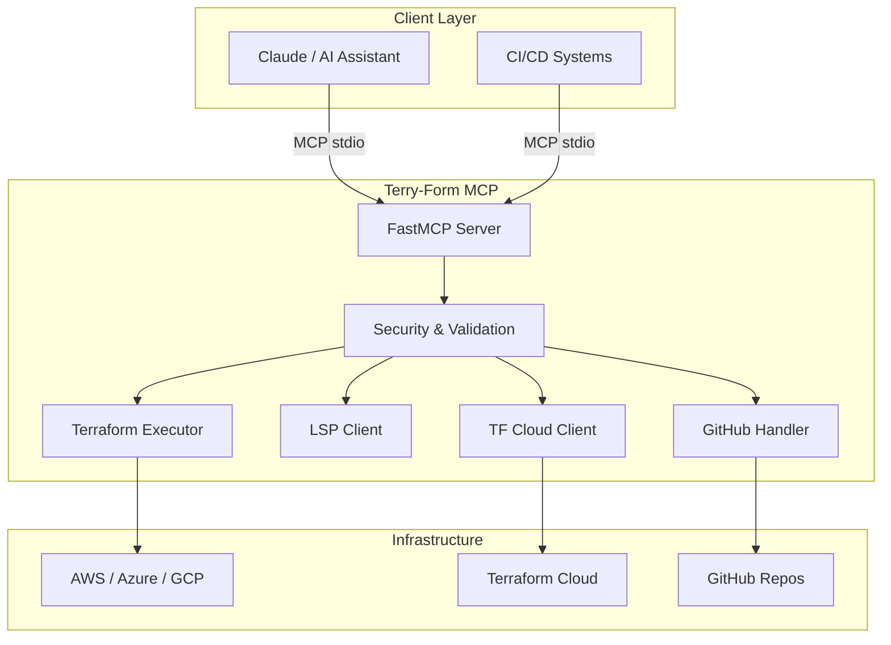

<div class="hero-section">
  <h1 class="hero-title">Terry-Form MCP</h1>
  <p class="hero-subtitle">Secure Terraform automation through Model Context Protocol</p>
  <div class="hero-buttons">
    <a href="{{ site.baseurl }}/getting-started" class="btn btn-primary btn-large">Get Started</a>
    <a href="{{ site.baseurl }}/guides/" class="btn btn-secondary btn-large">View Guides</a>
    <a href="{{ site.data.project.repo_url }}" class="btn btn-github btn-large" target="_blank" rel="noopener noreferrer">
      <i class="fab fa-github"></i> GitHub
    </a>
  </div>
</div>

<div class="features-grid">
  <div class="feature-card">
    <div class="feature-icon"><i class="fas fa-shield-alt"></i></div>
    <h3>Security First</h3>
    <p>Destructive operations blocked by default. Input validation, path traversal protection, and sandboxed execution in Docker containers.</p>
  </div>

  <div class="feature-card">
    <div class="feature-icon"><i class="fas fa-robot"></i></div>
    <h3>AI-Powered</h3>
    <p>Native MCP protocol integration for seamless AI assistant workflows. {{ site.data.project.tool_count }} tools for comprehensive Terraform automation.</p>
  </div>

  <div class="feature-card">
    <div class="feature-icon"><i class="fas fa-cloud"></i></div>
    <h3>Multi-Cloud</h3>
    <p>Support for AWS, Azure, GCP credential passthrough. Terraform Cloud workspace monitoring and state output retrieval.</p>
  </div>

  <div class="feature-card">
    <div class="feature-icon"><i class="fas fa-code"></i></div>
    <h3>Developer Friendly</h3>
    <p>LSP integration via terraform-ls {{ site.data.project.terraform_ls }}, GitHub App support, and comprehensive tool discovery.</p>
  </div>

  <div class="feature-card">
    <div class="feature-icon"><i class="fas fa-search"></i></div>
    <h3>Code Intelligence</h3>
    <p>LSP-powered validation, hover docs, completions, formatting, security scanning, and best practice recommendations.</p>
  </div>

  <div class="feature-card">
    <div class="feature-icon"><i class="fas fa-rocket"></i></div>
    <h3>Production Ready</h3>
    <p>Docker containerization on {{ site.data.project.base_image }}. Non-root execution (UID {{ site.data.project.container_uid }}), rate limiting, and forced automation flags.</p>
  </div>
</div>

## What is Terry-Form MCP?

Terry-Form MCP is a secure, production-ready Terraform automation server that integrates with AI assistants through the [Model Context Protocol](https://modelcontextprotocol.io) (MCP). It provides a controlled environment for infrastructure-as-code operations with comprehensive LSP integration for intelligent development.

```mermaid
graph LR
    A[AI Assistant] -->|MCP stdio| B[Terry-Form Server]
    B --> C[Terraform {{ site.data.project.terraform }}]
    B --> D[Security Layer]
    B --> E[terraform-ls]
    C --> F[Cloud Providers]
    D --> G[Input Validation]
    D --> H[Path Protection]
```

## Key Features

### Security Hardened

- **Destructive ops blocked**: `apply` and `destroy` are never allowed
- **Input Validation**: Comprehensive request validation and sanitization
- **Path Traversal Protection**: All operations restricted to `/mnt/workspace`
- **Sandboxed Execution**: Docker container with dropped capabilities

### MCP Protocol Integration

- **Native MCP Support**: Built with FastMCP {{ site.data.project.fastmcp }} for async tool handling
- **{{ site.data.project.tool_count }} Tools**: Core Terraform, LSP intelligence, GitHub, Terraform Cloud
- **Streaming Responses**: Real-time operation feedback
- **Error Handling**: Graceful error reporting with structured responses

### Infrastructure Management

- **Multi-Workspace**: Manage multiple Terraform workspaces in `/mnt/workspace`
- **Plan Analysis**: Execute `init`, `validate`, `fmt`, and `plan`
- **LSP Integration**: terraform-ls for hover docs, completions, diagnostics, and formatting
- **Security Scanning**: Built-in vulnerability detection and best practice analysis

### Integrations

- **GitHub App**: Clone repos, list Terraform files, prepare workspaces via OAuth
- **Terraform Cloud**: List workspaces, view runs, get state outputs
- **LSP Support**: Full Language Server Protocol via terraform-ls {{ site.data.project.terraform_ls }}
- **Cloud Providers**: AWS, Azure, GCP credential passthrough

## Quick Start

Configure your MCP client (e.g., Claude Desktop) to use Terry-Form:

```json
{
  "mcpServers": {
    "terry-form": {
      "command": "docker",
      "args": [
        "run", "-i", "--rm",
        "-v", "./workspace:/mnt/workspace",
        "terry-form-mcp:latest"
      ]
    }
  }
}
```

Build and verify:

```bash
# Build the Docker image
docker build -t terry-form-mcp .

# Run verification suite (8 checks)
scripts/verify.sh
```

## Use Cases

<div class="use-cases">
  <div class="use-case">
    <h3><i class="fas fa-building"></i> Enterprise Infrastructure</h3>
    <p>Manage complex multi-cloud environments with security controls and compliance</p>
  </div>

  <div class="use-case">
    <h3><i class="fas fa-sync-alt"></i> CI/CD Integration</h3>
    <p>Automate Terraform validation and planning in your deployment pipelines</p>
  </div>

  <div class="use-case">
    <h3><i class="fas fa-users"></i> Team Collaboration</h3>
    <p>Enable safe infrastructure changes through AI-assisted workflows</p>
  </div>

  <div class="use-case">
    <h3><i class="fas fa-graduation-cap"></i> Learning Platform</h3>
    <p>Safe environment for learning Terraform with destructive ops blocked</p>
  </div>
</div>

## Architecture Overview


```mermaid
graph TB
    subgraph "Client Layer"
        A[Claude / AI Assistant]
        D[CI/CD Systems]
    end

    subgraph "Terry-Form MCP"
        E[FastMCP Server]
        F[Security & Validation]
        G[Terraform Executor]
        H[LSP Client]
        I[GitHub Handler]
        J[TF Cloud Client]
    end

    subgraph "Infrastructure"
        K[AWS / Azure / GCP]
        L[Terraform Cloud]
        M[GitHub Repos]
    end

    A -->|MCP stdio| E
    D -->|MCP stdio| E
    E --> F
    F --> G
    F --> H
    F --> I
    F --> J
    G --> K
    J --> L
    I --> M
```

## Getting Help

<div class="help-section">
  <div class="help-card">
    <h3><i class="fas fa-book"></i> Documentation</h3>
    <p>Comprehensive guides and API reference</p>
    <a href="{{ site.baseurl }}/guides/">View Guides</a>
  </div>

  <div class="help-card">
    <h3><i class="fas fa-comments"></i> Community</h3>
    <p>Join the community for support and discussions</p>
    <a href="{{ site.data.project.repo_url }}/discussions" target="_blank" rel="noopener noreferrer">GitHub Discussions</a>
  </div>

  <div class="help-card">
    <h3><i class="fas fa-bug"></i> Issues</h3>
    <p>Report bugs or request features</p>
    <a href="{{ site.data.project.repo_url }}/issues" target="_blank" rel="noopener noreferrer">GitHub Issues</a>
  </div>
</div>

---

<div class="footer-cta">
  <h2>Ready to get started?</h2>
  <p>Deploy Terry-Form MCP in minutes and start automating your infrastructure</p>
  <a href="{{ site.baseurl }}/getting-started" class="btn btn-primary btn-large">Get Started Now</a>
</div>
